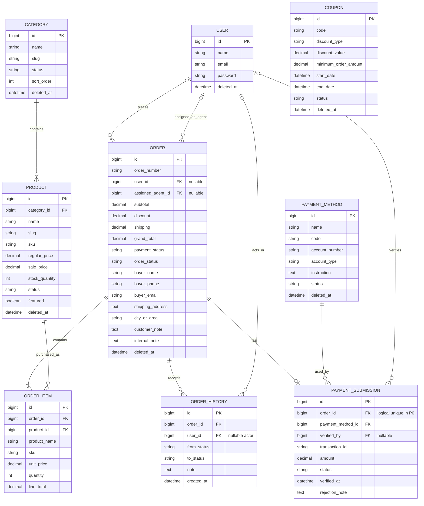
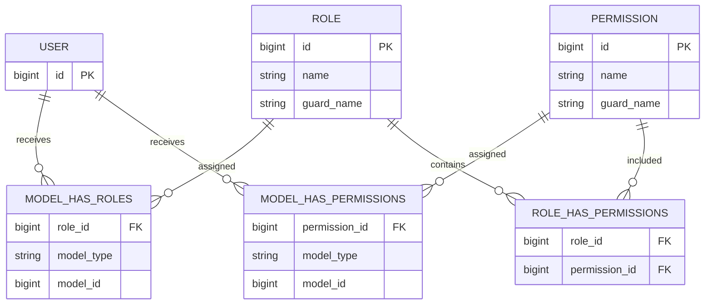

# ShopPilot E-commerce — Database ERD
# শপপাইলট ই-কমার্স — ডেটাবেজ ERD

> **Document:** Database Entity Relationship Diagram (ERD) / ডেটাবেজ Entity Relationship Diagram  
> **Project:** ShopPilot E-commerce  
> **Source Documents:**  
> `01-PROJECT-OVERVIEW-UPDATED.md` v1.1  
> `ShopPilot-02-PRD.md` v1.0  
> `ShopPilot-03-FEATURES.md` v1.0  
> `ShopPilot-04-USER-ROLES-AND-PERMISSIONS.md` v1.0  
> `ShopPilot-05-BUSINESS-RULES.md` v1.0  
> `ShopPilot-06-ARCHITECTURE.md` v1.0  
> **Project Type:** Role-Based Single-Store E-commerce & Order Operations System  
> **Architecture:** Service-Oriented Modular Laravel Monolith  
> **Database:** MySQL  
> **ORM:** Laravel Eloquent  
> **RBAC:** Spatie Laravel Permission  
> **Media:** Spatie Laravel Media Library  
> **Cart Persistence:** Laravel Session — no P0 Cart table  
> **Payment:** Manual bKash / Nagad / Rocket Submission  
> **Document Version:** 1.0  
> **Language:** English + Bangla  
> **Status:** Logical ERD Definition  
> **Next Document:** `08-DATABASE-SCHEMA.md`

---

# Table of Contents

1. Document Purpose  
2. ERD Scope  
3. Source-of-Truth Principles  
4. ERD Legend  
5. Database Boundary  
6. Entity Inventory  
7. P0 Application-Owned Entities  
8. Package-Managed Entities  
9. Framework / Optional Tables  
10. Explicitly Excluded Tables  
11. ERD Decision Log  
12. Core ERD — Mermaid  
13. Core ERD — Text View  
14. User Entity  
15. Category Entity  
16. Product Entity  
17. Coupon Entity  
18. Order Entity  
19. OrderItem Entity  
20. OrderHistory Entity  
21. PaymentMethod Entity  
22. PaymentSubmission Entity  
23. User ↔ Order Customer Relationship  
24. User ↔ Order Agent Relationship  
25. Category ↔ Product Relationship  
26. Product ↔ OrderItem Relationship  
27. Order ↔ OrderItem Relationship  
28. Order ↔ OrderHistory Relationship  
29. Order ↔ PaymentSubmission Relationship  
30. PaymentMethod ↔ PaymentSubmission Relationship  
31. User ↔ PaymentSubmission Verifier Relationship  
32. User ↔ OrderHistory Actor Relationship  
33. Coupon Relationship Boundary  
34. Buyer Snapshot Model  
35. Product Snapshot Model  
36. RBAC Package ERD  
37. Media Library ERD Boundary  
38. SoftDelete ERD Strategy  
39. Historical Record Preservation  
40. Guest Checkout Data Model  
41. Logged-in Customer Data Model  
42. Agent Assignment Data Model  
43. Payment Data Model  
44. Order State Data Model  
45. Checkout Transaction Write Set  
46. Referential Integrity Principles  
47. Nullable Relationship Matrix  
48. Cardinality Matrix  
49. Ownership Matrix  
50. ERD-Level Uniqueness Decisions  
51. Index Direction for Next Schema  
52. Delete / Restore Direction  
53. Optional P1 Entities  
54. Framework Tables  
55. No-Cart-Table Decision  
56. No-Separate-Customer-Table Decision  
57. No-Inventory-Ledger Decision  
58. No-Real-Payment-Gateway Tables  
59. No-Settings-Table Assumption  
60. Schema Decisions Deferred to 08  
61. ERD Validation Against Business Rules  
62. ERD Validation Against Architecture  
63. Critical Query Paths  
64. Migration Dependency Order  
65. ERD Anti-Patterns  
66. ERD Acceptance Criteria  
67. Definition of ERD Complete  
68. Final ERD Statement  
69. Next Documentation

---

# 1. Document Purpose

This document defines the **logical relational data model** for ShopPilot E-commerce.

এই ERD-এর উদ্দেশ্য:

- কোন core entity থাকবে তা formalize করা
- entity-to-entity cardinality define করা
- Guest Checkout-এর nullable ownership model define করা
- Customer এবং Agent—দুই relationship-এ `users` table reuse করা
- Order Item এবং Buyer historical snapshot model define করা
- manual Payment Method / Payment Submission relationship define করা
- Order History traceability define করা
- Spatie Permission এবং Media Library package boundary দেখানো
- Session Cart-এর জন্য database table না রাখার সিদ্ধান্ত record করা
- SoftDelete বনাম historical preservation boundary define করা
- `08-DATABASE-SCHEMA.md`-এর জন্য clear logical foundation তৈরি করা

This document is **logical ERD**, not final SQL DDL.

Exact data types, lengths, indexes, foreign-key actions, defaults and migration code belong to:

```text
08-DATABASE-SCHEMA.md
```

---

# 2. ERD Scope

P0 ERD includes application-owned entities:

```text
users
categories
products
coupons
orders
order_items
order_histories
payment_methods
payment_submissions
```

Package-managed data:

```text
roles
permissions
model_has_roles
model_has_permissions
role_has_permissions
media
```

Framework / optional:

```text
sessions
password_reset_tokens
notifications
addresses        P1 optional
activity_logs    P1 optional
```

---

# 3. Source-of-Truth Principles

This ERD follows these approved source rules:

```text
Guest can checkout without login.
Guest Order user_id may be null.
Logged-in Customer Order links to User.
Every Order preserves buyer/shipping snapshot.
Agent assignment uses User and may be null initially.
Product belongs to Category.
Order contains OrderItems.
Order has OrderHistory.
PaymentSubmission belongs to Order.
PaymentSubmission belongs to PaymentMethod.
PaymentSubmission verifier is nullable User.
Cart is session-based.
Historical records should be preserved.
```

Where source documents intentionally left a relationship undefined, this document either:

1. finalizes it explicitly as an ERD decision, or
2. leaves it deferred and labels it clearly.

No relationship should be silently invented.

---

# 4. ERD Legend

## Cardinality

```text
1        = exactly one
0..1     = zero or one
1..*     = one or many
0..*     = zero or many
```

## Key Legend

```text
PK = Primary Key
FK = Foreign Key
UQ = Logical Unique Key
N  = Nullable
SD = SoftDelete-enabled entity
```

## Relationship Words

```text
belongsTo
hasOne
hasMany
optional belongsTo
```

---

# 5. Database Boundary

ShopPilot uses:

```text
One Laravel Application
One MySQL Database
```

There is no:

```text
Tenant database
Vendor database
Warehouse database
Payment-provider database
Courier database
Microservice-owned database
```

---

# 6. Entity Inventory

## 6.1 P0 Application-Owned

| Entity | Purpose | P0 |
|---|---|---:|
| `users` | Authenticated Admin/Manager/Agent/Customer accounts | Yes |
| `categories` | Single-level Product grouping | Yes |
| `products` | Sellable Product + simple stock | Yes |
| `coupons` | Fixed / percentage discount definition | Yes |
| `orders` | Purchase aggregate + snapshots + workflow state | Yes |
| `order_items` | Historical purchased Product lines | Yes |
| `order_histories` | Important Order workflow changes | Yes |
| `payment_methods` | Admin-configured bKash/Nagad/Rocket | Yes |
| `payment_submissions` | Customer manual transaction proof submission | Yes |

## 6.2 Package-Managed

| Entity/Table | Owner |
|---|---|
| `roles` | Spatie Permission |
| `permissions` | Spatie Permission |
| `model_has_roles` | Spatie Permission |
| `model_has_permissions` | Spatie Permission |
| `role_has_permissions` | Spatie Permission |
| `media` | Spatie Media Library |

## 6.3 Framework / Optional

```text
sessions
password_reset_tokens
notifications
```

Optional P1:

```text
addresses
activity_logs
```

---

# 7. P0 Application-Owned Entities

```text
User
Category
Product
Coupon
Order
OrderItem
OrderHistory
PaymentMethod
PaymentSubmission
```

These are the core entities used throughout the logical ERD.

---

# 8. Package-Managed Entities

Package tables are not custom domain replacements.

## Spatie Permission

```text
roles
permissions
model_has_roles
model_has_permissions
role_has_permissions
```

## Spatie Media Library

```text
media
```

Do not recreate custom:

```text
user_roles
product_images
category_images
```

unless later requirements explicitly change package usage.

---

# 9. Framework / Optional Tables

Possible Laravel framework tables:

```text
sessions
password_reset_tokens
notifications
```

Their presence depends on selected Laravel configuration/features.

They are not core commerce domain entities.

---

# 10. Explicitly Excluded Tables

P0 ERD must not introduce:

```text
carts
cart_items
product_variants
warehouses
inventory_movements
vendors
shops
courier_shipments
payment_gateway_transactions
refunds
currencies
tax_rules
affiliate_accounts
accounting_ledgers
```

Reason:

```text
Not part of approved 13-day MVP.
```

---

# 11. ERD Decision Log

## ERD-DEC-001 — Order → PaymentSubmission Cardinality

The source Architecture explicitly deferred:

```text
Order hasOne PaymentSubmission
OR
Order hasMany PaymentSubmissions
```

### P0 ERD Decision

Use:

```text
Order 1
   ↓
0..1 PaymentSubmission
```

Eloquent direction:

```text
Order hasOne PaymentSubmission
PaymentSubmission belongsTo Order
```

### Why

Approved P0 flow contains:

```text
Checkout
→ one Transaction ID submission
→ submitted
→ staff verify / reject
```

No retry/resubmission workflow is defined for the P0 MVP.

### Future Evolution

If future requirements add:

```text
Payment retry
Transaction resubmission
Multiple payment attempts
```

this relationship may evolve to:

```text
Order hasMany PaymentSubmissions
```

That future behavior is not part of this ERD.

---

## ERD-DEC-002 — No Separate Customer Table

Use:

```text
users
```

for authenticated Customer accounts.

Customer identity is represented through Spatie role/context.

Guest does not require a User row.

Therefore:

```text
No customers table
```

for the P0 core model.

---

## ERD-DEC-003 — Same Users Table for Staff and Customer

`users` represents authenticated:

```text
Admin
Manager
Agent
Customer
```

Role separation comes through:

```text
Spatie Permission
```

not separate staff/customer tables.

---

## ERD-DEC-004 — Agent Assignment Uses users.id

`orders.assigned_agent_id` conceptually references:

```text
users.id
```

The application validates that the target User is an Agent.

---

## ERD-DEC-005 — Verifier Uses users.id

`payment_submissions.verified_by` conceptually references:

```text
users.id
```

and is nullable until verification/rejection action requires an actor.

---

## ERD-DEC-006 — No Persistent Cart Entity

Cart remains:

```text
Laravel Session
```

No `carts` / `cart_items` P0 tables.

---

## ERD-DEC-007 — Coupon Relationship Not Invented

Sources define:

```text
Coupon entity
One Coupon per Order
No stacking
Order discount snapshot
```

but do not explicitly define:

```text
orders.coupon_id
```

Therefore this ERD does **not** silently add a mandatory Order → Coupon FK.

The exact decision whether to preserve applied Coupon identity through:

```text
coupon_id
coupon_code_snapshot
or discount-only snapshot
```

is deferred to `08-DATABASE-SCHEMA.md`.

---

# 12. Core ERD — Mermaid



> Mermaid field list is conceptual. Exact MySQL types/lengths/defaults/indexes belong to `08-DATABASE-SCHEMA.md`.

---

# 13. Core ERD — Text View

```text
USER
│
├── 0..* ORDERS as Customer
│      └── orders.user_id nullable
│
├── 0..* ORDERS as Assigned Agent
│      └── orders.assigned_agent_id nullable
│
├── 0..* ORDER_HISTORIES as Actor
│      └── order_histories.user_id nullable
│
├── 0..* PAYMENT_SUBMISSIONS as Verifier
│      └── payment_submissions.verified_by nullable
│
└── Spatie Roles / Permissions


CATEGORY
│
└── 0..* PRODUCTS
       │
       └── 0..* ORDER_ITEMS


ORDER
│
├── 1..* ORDER_ITEMS
├── 0..* ORDER_HISTORIES
└── 0..1 PAYMENT_SUBMISSION
          │
          └── exactly 1 PAYMENT_METHOD


COUPON
└── P0 entity, but direct Order FK is not finalized in source docs.
```

---

# 14. User Entity

## Purpose

`users` stores authenticated actors:

```text
Admin
Manager
Agent
Customer
```

Guest Customer does not require a `users` row.

## Conceptual Responsibilities

```text
Authentication identity
Profile identity
Role assignment
Permission assignment
Customer ownership
Agent assignment target
Payment verifier identity
History actor identity
```

## Conceptual Key

```text
id PK
```

## SoftDelete

Recommended:

```text
Yes
```

## Relationships

```text
User 0..* Orders as Customer
User 0..* Orders as Assigned Agent
User 0..* PaymentSubmissions as Verifier
User 0..* OrderHistories as Actor
User ↔ Roles / Permissions
User ↔ Media optional avatar
```

---

# 15. Category Entity

## Purpose

Single-level Product classification.

## Approved Concepts

```text
id
name
slug
description
status
sort_order
deleted_at
```

Image is managed through Spatie Media Library.

## Relationship

```text
Category 1
   ↓
0..* Products
```

Every Product belongs to a Category according to the approved logical model.

## SoftDelete

```text
Yes
```

---

# 16. Product Entity

## Purpose

Store sellable item and simple stock.

## Approved Concepts

```text
id
category_id
name
slug
sku
short_description
description
regular_price
sale_price
stock_quantity
status
featured
deleted_at
```

Media:

```text
product_thumbnail
product_gallery
```

through Spatie Media Library.

## Relationships

```text
Product belongsTo Category
Product hasMany OrderItems
Product morphMany Media
```

## Important Historical Boundary

`OrderItem` snapshots preserve:

```text
Product Name
SKU
Unit Price
```

Therefore historical Order display does not depend entirely on current Product values.

## SoftDelete

```text
Yes
```

---

# 17. Coupon Entity

## Purpose

Define discount rules.

## Approved Concepts

```text
id
code
discount_type
discount_value
minimum_order_amount
start_date
end_date
status
deleted_at
```

## Discount Types

```text
fixed
percentage
```

## Business Rule

```text
One Coupon per Order
No Coupon stacking
```

## Relationship Status

Direct FK from Order to Coupon is:

```text
NOT FINALIZED BY SOURCE DOCUMENTS
```

Therefore no direct core ERD line is forced here.

## SoftDelete

```text
Yes
```

---

# 18. Order Entity

## Purpose

`orders` is the primary purchase aggregate.

## Conceptual Identity

```text
id
order_number
```

## Customer / Guest Ownership

```text
user_id nullable
```

Meaning:

```text
Logged-in Customer
→ user_id = authenticated User id

Guest Customer
→ user_id = null
```

## Agent Assignment

```text
assigned_agent_id nullable
```

New Order may exist before assignment.

## Financial Snapshot

```text
subtotal
discount
shipping
grand_total
```

Exact shipping calculation remains undefined by current business rules.

## Status Concepts

```text
payment_status
order_status
```

These are separate business states.

## Buyer Snapshot

```text
buyer_name
buyer_phone
buyer_email
shipping_address
city_or_area
```

## Notes

```text
customer_note
internal_note
```

`internal_note` is staff-only.

## SoftDelete

```text
Yes
```

## Relationships

```text
Order optional belongsTo Customer/User
Order optional belongsTo Assigned Agent/User
Order hasMany OrderItems
Order hasMany OrderHistories
Order hasOne PaymentSubmission in P0 ERD
```

---

# 19. OrderItem Entity

## Purpose

Preserve purchased Product line details.

## Conceptual Data

```text
id
order_id
product_id
product_name snapshot
sku snapshot
unit_price snapshot
quantity
line_total
```

## Relationships

```text
OrderItem belongsTo Order
OrderItem belongsTo Product
```

## Historical Rule

The following are snapshot fields:

```text
product_name
sku
unit_price
line_total
```

Current Product update must not rewrite them.

## SoftDelete

Not recommended by current documents.

Historical Order Items should be preserved.

---

# 20. OrderHistory Entity

## Purpose

Store important Order workflow changes.

## Conceptual Data

```text
id
order_id
user_id nullable actor
from_status
to_status
note
created_at
```

## Relationships

```text
OrderHistory belongsTo Order
OrderHistory optional belongsTo User as Actor
```

## Why Actor May Be Nullable

Some history may originate from:

```text
Guest checkout initialization
System operation
```

Source documents treat `user_id` as an actor concept and historical data must remain preservable.

Exact nullability and system-actor strategy are finalized in Schema.

## SoftDelete

No.

History should be preserved.

---

# 21. PaymentMethod Entity

## Purpose

Store manual MFS configuration.

P0 examples:

```text
bKash
Nagad
Rocket
```

## Approved Concepts

```text
id
name
code
account_number
account_type
instruction
status
deleted_at
```

## Relationship

```text
PaymentMethod 1
    ↓
0..* PaymentSubmissions
```

## SoftDelete

```text
Yes
```

Historical PaymentSubmission should remain even if a PaymentMethod is later soft-deleted.

---

# 22. PaymentSubmission Entity

## Purpose

Represent Customer-provided manual payment proof/information.

## Conceptual Data

```text
id
order_id
payment_method_id
transaction_id
amount
status
verified_by
verified_at
rejection_note
created_at
updated_at
```

## Initial State

```text
submitted
```

not:

```text
verified
```

## Relationships

```text
PaymentSubmission belongsTo Order
PaymentSubmission belongsTo PaymentMethod
PaymentSubmission optional belongsTo User as Verifier
```

## P0 Order Cardinality

```text
One Order
→ zero or one PaymentSubmission
```

## SoftDelete

No.

PaymentSubmission is historical/operational evidence and should be preserved.

---

# 23. User ↔ Order Customer Relationship

Relationship:

```text
User 1
   ↓
0..* Orders
```

From Order side:

```text
Order 0..1
   ↓
User
```

because Guest Checkout is allowed.

Conceptual FK:

```text
orders.user_id
→ users.id
nullable
```

Business meaning:

```text
Authenticated Order
→ user_id set

Guest Order
→ user_id null
```

---

# 24. User ↔ Order Agent Relationship

Relationship:

```text
User 1
   ↓
0..* Assigned Orders
```

From Order side:

```text
Order 0..1 Assigned Agent
```

Conceptual FK:

```text
orders.assigned_agent_id
→ users.id
nullable
```

Application-level invariant:

```text
assigned_agent_id target must be an Agent
```

This role rule is validated by application authorization/business logic.

---

# 25. Category ↔ Product Relationship

```text
Category 1
   ↓
0..* Products

Product
→ exactly 1 Category
```

Conceptual FK:

```text
products.category_id
→ categories.id
```

P0 uses:

```text
Single-Level Category
```

No parent category relationship is required.

---

# 26. Product ↔ OrderItem Relationship

```text
Product 1
   ↓
0..* OrderItems
```

Conceptual FK:

```text
order_items.product_id
→ products.id
```

Historical independence is achieved through OrderItem snapshots.

Soft-deleting a Product must not erase historical Order Items.

Exact FK delete action is deferred to Schema.

---

# 27. Order ↔ OrderItem Relationship

```text
Order 1
   ↓
1..* OrderItems
```

Each valid purchase Order should contain one or more Order Items.

Conceptual FK:

```text
order_items.order_id
→ orders.id
```

Order creation and Order Items are part of the Checkout transaction boundary.

---

# 28. Order ↔ OrderHistory Relationship

```text
Order 1
   ↓
0..* OrderHistories
```

Important changes create history.

Conceptual FK:

```text
order_histories.order_id
→ orders.id
```

Initial Order History is part of Checkout critical writes.

---

# 29. Order ↔ PaymentSubmission Relationship

## P0 Finalized ERD

```text
Order 1
   ↓
0..1 PaymentSubmission
```

Conceptual FK:

```text
payment_submissions.order_id
→ orders.id
```

P0 logical uniqueness:

```text
one payment_submissions row per order
```

`08-DATABASE-SCHEMA.md` should implement an appropriate uniqueness rule if this ERD decision remains approved.

---

# 30. PaymentMethod ↔ PaymentSubmission Relationship

```text
PaymentMethod 1
   ↓
0..* PaymentSubmissions
```

Each PaymentSubmission uses exactly one selected manual PaymentMethod.

Conceptual FK:

```text
payment_submissions.payment_method_id
→ payment_methods.id
```

---

# 31. User ↔ PaymentSubmission Verifier Relationship

```text
User 1
   ↓
0..* Verified PaymentSubmissions
```

From PaymentSubmission side:

```text
Verifier = 0..1 User
```

Conceptual FK:

```text
payment_submissions.verified_by
→ users.id
nullable
```

Before verification:

```text
verified_by = null
verified_at = null
```

---

# 32. User ↔ OrderHistory Actor Relationship

```text
User 1
   ↓
0..* OrderHistories
```

Conceptual FK:

```text
order_histories.user_id
→ users.id
nullable
```

Purpose:

```text
Who performed the meaningful Order change?
```

Exact system/guest actor handling remains a Schema/Application Flow detail.

---

# 33. Coupon Relationship Boundary

Approved business behavior requires:

```text
One valid Coupon per Order
No stacking
Server-side discount calculation
```

However source relationships do not explicitly define:

```text
Order belongsTo Coupon
```

Therefore this logical ERD keeps Coupon as an application entity without forcing a direct FK.

`08-DATABASE-SCHEMA.md` must explicitly choose one of the supported approaches based on existing requirements, for example:

```text
A. nullable coupon_id
B. coupon_code snapshot
C. discount snapshot only
```

No choice should be hidden.

---

# 34. Buyer Snapshot Model

Order must preserve historical checkout identity.

```text
orders
├── buyer_name
├── buyer_phone
├── buyer_email
├── shipping_address
└── city_or_area
```

This applies to:

```text
Guest
Logged-in Customer
```

Snapshot data is not a foreign relation.

It is historical Order-owned data.

---

# 35. Product Snapshot Model

OrderItem owns historical purchased Product facts.

```text
order_items
├── product_name
├── sku
├── unit_price
├── quantity
└── line_total
```

`product_id` provides current reference.

Snapshot columns preserve purchase-time facts.

---

# 36. RBAC Package ERD

Spatie Laravel Permission provides:

```text
roles
permissions
model_has_roles
model_has_permissions
role_has_permissions
```

Simplified ShopPilot relationship:



Important:

Spatie pivot tables are package-defined.

Do not redesign their physical schema in this ERD.

---

# 37. Media Library ERD Boundary

Spatie Media Library uses a polymorphic media model.

Conceptually:

```text
Product
  ↘
   MEDIA

Category
  ↗

User optional avatar
  ↗
```

Media table conceptually includes package-managed polymorphic identifiers such as:

```text
model_type
model_id
collection_name
```

ShopPilot collections:

```text
product_thumbnail
product_gallery
category_image
user_avatar optional
```

No custom `product_images` table is required for P0.

---

# 38. SoftDelete ERD Strategy

Recommended SoftDelete entities:

```text
users
categories
products
coupons
orders
payment_methods
```

Historical records to preserve:

```text
order_items
order_histories
payment_submissions
```

Force Delete:

```text
Not required for MVP
```

---

# 39. Historical Record Preservation

Historical chain:

```text
Order
├── Buyer Snapshot
├── Shipping Snapshot
├── OrderItems
│   └── Product Snapshot
├── OrderHistories
└── PaymentSubmission
```

Current mutable records must not rewrite historical facts.

---

# 40. Guest Checkout Data Model

Guest flow:

```text
Guest
   ↓
No User row required
   ↓
Order
├── user_id = null
├── buyer snapshot
├── shipping snapshot
├── OrderItems
├── PaymentSubmission
└── OrderHistory
```

Guest Checkout must not require:

```text
Customer table
Guest role row
Guest user row
```

---

# 41. Logged-in Customer Data Model

```text
User(Customer)
   ↓
Order.user_id
   ↓
Order
├── buyer snapshot
├── shipping snapshot
├── OrderItems
├── PaymentSubmission
└── OrderHistory
```

Important:

The User relation and historical snapshot both exist.

The snapshot is not replaced by the relation.

---

# 42. Agent Assignment Data Model

```text
Order.assigned_agent_id nullable
           ↓
        users.id
           ↓
      User with Agent role
```

Before assignment:

```text
assigned_agent_id = null
```

After authorized assignment:

```text
assigned_agent_id = selected Agent user id
```

Assignment history should be traceable.

---

# 43. Payment Data Model

```text
PaymentMethod
     │
     │ 1
     │
     └──── 0..* PaymentSubmission
                    │
                    │ exactly 1
                    ▼
                  Order
```

More precisely for P0:

```text
Order 1 ───── 0..1 PaymentSubmission
PaymentMethod 1 ───── 0..* PaymentSubmissions
User 1 ───── 0..* verified PaymentSubmissions
```

---

# 44. Order State Data Model

Order state concept:

```text
orders.order_status
```

Approved values:

```text
pending
confirmed
processing
shipped
delivered
cancelled
```

Payment state concept:

```text
orders.payment_status
```

Approved values:

```text
unpaid
submitted
verified
rejected
```

These are separate state dimensions.

---

# 45. Checkout Transaction Write Set

Critical transaction writes:

```text
Order
OrderItems
PaymentSubmission
Product stock_quantity mutation
Initial OrderHistory
```

Conceptual transaction:

```text
BEGIN

orders INSERT
order_items INSERT(s)
payment_submissions INSERT
products.stock_quantity UPDATE(s)
order_histories INSERT

COMMIT
```

On failure:

```text
ROLLBACK
```

---

# 46. Referential Integrity Principles

## Core

```text
Product → Category
OrderItem → Order
OrderItem → Product
OrderHistory → Order
PaymentSubmission → Order
PaymentSubmission → PaymentMethod
```

should use relational integrity where compatible with SoftDelete/history strategy.

## Nullable Actor/Ownership References

```text
Order.user_id
Order.assigned_agent_id
OrderHistory.user_id
PaymentSubmission.verified_by
```

may be nullable according to approved workflow.

Exact FK `ON DELETE` actions are deferred to Schema.

---

# 47. Nullable Relationship Matrix

| FK Concept | Nullable? | Reason |
|---|---:|---|
| `products.category_id` | No in logical P0 | Product belongs to Category |
| `orders.user_id` | Yes | Guest Checkout |
| `orders.assigned_agent_id` | Yes | Order may be unassigned |
| `order_items.order_id` | No | Item requires Order |
| `order_items.product_id` | No in logical P0 | Purchased Product reference |
| `order_histories.order_id` | No | History requires Order |
| `order_histories.user_id` | Yes | Guest/System actor possibility |
| `payment_submissions.order_id` | No | Submission requires Order |
| `payment_submissions.payment_method_id` | No | Submission requires method |
| `payment_submissions.verified_by` | Yes | Not verified initially |

Final database constraints belong to `08-DATABASE-SCHEMA.md`.

---

# 48. Cardinality Matrix

| Parent | Child | Cardinality | P0 Decision |
|---|---|---|---|
| User (Customer) | Order | 1 → 0..* | Yes |
| User (Agent) | Order | 1 → 0..* | Yes |
| Category | Product | 1 → 0..* | Yes |
| Product | OrderItem | 1 → 0..* | Yes |
| Order | OrderItem | 1 → 1..* | Yes |
| Order | OrderHistory | 1 → 0..* | Yes |
| Order | PaymentSubmission | 1 → 0..1 | **Finalized in ERD** |
| PaymentMethod | PaymentSubmission | 1 → 0..* | Yes |
| User (Verifier) | PaymentSubmission | 1 → 0..* | Yes |
| User (Actor) | OrderHistory | 1 → 0..* | Yes |
| Coupon | Order | Undefined | Deferred to Schema decision |
| Model | Media | 1 → 0..* polymorphic | Package-managed |

---

# 49. Ownership Matrix

| Entity | Ownership / Access Context |
|---|---|
| User | Self / Admin controls where authorized |
| Category | Store-level shared resource |
| Product | Store-level shared resource |
| Coupon | Store-level shared resource |
| Order | Customer relation nullable; staff workflow |
| OrderItem | Owned by Order |
| OrderHistory | Owned by Order |
| PaymentMethod | Store configuration |
| PaymentSubmission | Owned by Order |
| Media | Polymorphic owner model |

Database relation does not replace Policy authorization.

---

# 50. ERD-Level Uniqueness Decisions

Logical uniqueness clearly implied:

```text
users.id PK
categories.id PK
products.id PK
coupons.id PK
orders.id PK
order_items.id PK
order_histories.id PK
payment_methods.id PK
payment_submissions.id PK
```

Business identifiers expected to be unique conceptually:

```text
orders.order_number
products.sku
```

Likely unique identifiers such as:

```text
category.slug
product.slug
coupon.code
payment_method.code
user.email
```

need exact constraint confirmation in `08-DATABASE-SCHEMA.md`.

## P0 Payment Submission Relationship Uniqueness

Because ERD uses:

```text
Order hasOne PaymentSubmission
```

`payment_submissions.order_id` should be treated as logically unique for P0.

Exact SQL index is defined next.

## Transaction ID

Uniqueness scope remains:

```text
TBD
```

Do not assume global uniqueness yet.

---

# 51. Index Direction for Next Schema

Potential indexes should be reviewed in Schema for common relationships/query paths:

```text
products.category_id
products.status
orders.user_id
orders.assigned_agent_id
orders.order_status
orders.payment_status
order_items.order_id
order_items.product_id
order_histories.order_id
payment_submissions.order_id
payment_submissions.payment_method_id
payment_submissions.verified_by
payment_submissions.status
```

This section is directional only.

Exact composite indexes belong to `08-DATABASE-SCHEMA.md`.

---

# 52. Delete / Restore Direction

Because SoftDeletes are used:

```text
User
Category
Product
Coupon
Order
PaymentMethod
```

normal application deletion should not destroy historical purchase records.

Historical rows:

```text
OrderItem
OrderHistory
PaymentSubmission
```

must remain preserved.

Exact foreign-key actions such as:

```text
RESTRICT
SET NULL
CASCADE
```

are deliberately deferred to the Schema document.

---

# 53. Optional P1 Entities

## Address

Optional:

```text
addresses
```

Possible purpose:

```text
Reusable Customer address book
```

Not required because P0 Order already stores delivery snapshot.

---

## Activity Log

Optional:

```text
activity_logs
```

Possible purpose:

```text
Generic operational activity trail
```

Not required because OrderHistory already covers important Order workflow changes.

Do not make either entity a P0 dependency.

---

# 54. Framework Tables

Depending on Laravel setup:

```text
sessions
password_reset_tokens
notifications
```

## Sessions

May back authenticated/session behavior.

Cart remains application Session data rather than a dedicated cart-domain table.

## Password Reset

P1 Forgot Password may use:

```text
password_reset_tokens
```

## Notifications

P1 database notification may use:

```text
notifications
```

---

# 55. No-Cart-Table Decision

Architecture defines:

```text
Session-Based Cart
```

Therefore ERD excludes:

```text
carts
cart_items
```

Checkout converts valid session Cart state into persistent:

```text
Order
OrderItems
```

---

# 56. No-Separate-Customer-Table Decision

Authenticated Customer is:

```text
User + Customer role/context
```

Guest Customer:

```text
No User row required
```

Therefore no core:

```text
customers
```

table is introduced.

Buyer details live as Order snapshots.

---

# 57. No-Inventory-Ledger Decision

P0 stock:

```text
products.stock_quantity
```

Therefore ERD excludes:

```text
inventory_movements
stock_ledgers
warehouses
warehouse_stocks
```

Stock mutation is part of Checkout transaction.

---

# 58. No-Real-Payment-Gateway Tables

Manual payment system does not require:

```text
gateway_webhooks
gateway_callbacks
provider_transactions
payment_intents
refund_transactions
```

P0 uses:

```text
payment_methods
payment_submissions
```

---

# 59. No-Settings-Table Assumption

Source documents define:

```text
settings.view
settings.update
Manage settings
```

but the approved core entity list does **not** define a `settings` table/entity.

Therefore this ERD does not silently create:

```text
settings
```

The technical storage mechanism for store settings must be defined later only if required.

---

# 60. Schema Decisions Deferred to 08

The following exact physical decisions belong to `08-DATABASE-SCHEMA.md`:

```text
Column data types
String lengths
Decimal precision/scale
Default values
Unsigned rules
FK names
ON DELETE behavior
ON UPDATE behavior
Indexes
Composite indexes
Unique constraints
Nullable implementation
Enum storage strategy
Timestamp columns
SoftDelete column details
Coupon-to-Order persistence strategy
Transaction ID uniqueness scope
System actor history strategy
```

---

# 61. ERD Validation Against Business Rules

## Guest Checkout

ERD supports:

```text
orders.user_id nullable
buyer snapshot on Order
```

---

## Customer Ownership

ERD supports:

```text
orders.user_id → users.id
```

Policy still enforces own-Order access.

---

## Agent Ownership

ERD supports:

```text
orders.assigned_agent_id → users.id
```

Policy still enforces assigned-Order access.

---

## Server-Side Stock

ERD uses:

```text
products.stock_quantity
```

No client financial/stock state is stored as authority.

---

## Manual Payment

ERD separates:

```text
Order
PaymentMethod
PaymentSubmission
```

---

## Payment Verification

ERD supports:

```text
status
verified_by
verified_at
rejection_note
```

---

## Order History

ERD supports:

```text
Order 1 → many OrderHistories
```

---

## Historical Product Data

ERD supports:

```text
OrderItem snapshots
```

---

# 62. ERD Validation Against Architecture

Architecture requires core Eloquent entities:

```text
User
Category
Product
Coupon
Order
OrderItem
OrderHistory
PaymentMethod
PaymentSubmission
```

ERD includes all of them.

Architecture requires:

```text
Session Cart
```

ERD creates no Cart table.

Architecture requires:

```text
Spatie Permission
Spatie Media Library
```

ERD recognizes package-managed tables rather than replacing them.

Architecture requires transaction-safe Checkout.

ERD groups the exact persistent write set required for that transaction.

---

# 63. Critical Query Paths

ERD supports key P0 queries.

## Customer My Orders

```text
orders
WHERE user_id = authenticated_user_id
```

---

## Agent My Orders

```text
orders
WHERE assigned_agent_id = authenticated_agent_id
```

---

## Storefront Category Products

```text
categories
→ products
```

---

## Order Detail

```text
orders
→ order_items
→ product reference
```

---

## Order Timeline

```text
orders
→ order_histories
```

---

## Pending Payment Verification

```text
payment_submissions
WHERE status = submitted
```

joined to:

```text
orders
payment_methods
```

---

## Dashboard Low Stock

```text
products.stock_quantity
```

with application-defined threshold.

---

# 64. Migration Dependency Order

Logical dependency order for future migrations:

```text
1. users
2. Spatie Permission tables
3. categories
4. products
5. coupons
6. payment_methods
7. orders
8. order_items
9. order_histories
10. payment_submissions
11. media / package migration according to package setup
12. optional framework/P1 tables as configured
```

Exact migration ordering may vary based on package installation, but FK dependencies must remain valid.

---

# 65. ERD Anti-Patterns

Do not:

## 65.1 Create Customer and User Duplication

Avoid:

```text
users
customers
```

for the same authenticated account model without an approved need.

---

## 65.2 Store Cart as Order Too Early

Session Cart is not persistent Order data until Checkout succeeds.

---

## 65.3 Depend on Current Product Price for Old Orders

Always preserve OrderItem price snapshot.

---

## 65.4 Depend on Current Customer Profile for Old Orders

Always preserve Order buyer/shipping snapshot.

---

## 65.5 Merge Order Status and Payment Status

Keep separate:

```text
order_status
payment_status
```

---

## 65.6 Treat Transaction ID as Verification

PaymentSubmission remains:

```text
submitted
```

until authorized verification.

---

## 65.7 Add Variant / Warehouse Tables

Not part of P0.

---

## 65.8 Redesign Package Tables

Use package-owned Spatie schemas.

---

# 66. ERD Acceptance Criteria

ERD is acceptable when:

- [ ] P0 application-owned entities are limited to approved core entities.
- [ ] `users` supports Admin, Manager, Agent and Customer.
- [ ] Guest does not require User row.
- [ ] `orders.user_id` supports null Guest ownership.
- [ ] `orders.assigned_agent_id` supports nullable Agent assignment.
- [ ] Category has many Products.
- [ ] Product belongs to Category.
- [ ] Order has one or more OrderItems.
- [ ] OrderItem stores Product snapshots.
- [ ] Order has many OrderHistories.
- [ ] Order preserves buyer/shipping snapshots.
- [ ] PaymentSubmission belongs to Order.
- [ ] PaymentSubmission belongs to PaymentMethod.
- [ ] Payment verifier is optional User relation.
- [ ] P0 Order → PaymentSubmission relationship is explicitly finalized as `hasOne`.
- [ ] Transaction ID uniqueness remains explicitly deferred.
- [ ] Coupon-to-Order FK is not silently invented.
- [ ] Spatie Permission tables are recognized.
- [ ] Spatie Media table is recognized.
- [ ] No persistent Cart table is added.
- [ ] SoftDelete entities match approved scope.
- [ ] Historical OrderItems/Histories/PaymentSubmissions are preserved.
- [ ] No warehouse/inventory ledger is added.
- [ ] No real gateway tables are added.
- [ ] Optional P1 tables are not P0 dependencies.
- [ ] Physical schema details remain for `08-DATABASE-SCHEMA.md`.

---

# 67. Definition of ERD Complete

Before moving to Database Schema, the following must be clear:

```text
Core Entities
Package Entities
Primary Relationships
Nullable Relationships
Relationship Cardinalities
Guest Ownership Model
Customer Ownership Model
Agent Assignment Model
Payment Submission Model
Verifier Model
Order History Model
Buyer Snapshot Model
Product Snapshot Model
SoftDelete Boundary
Historical Preservation Boundary
Session Cart Boundary
P0 PaymentSubmission Cardinality Decision
Deferred Schema Decisions
```

---

# 68. Final ERD Statement

ShopPilot's P0 relational model is centered around:

```text
User
Category
Product
Coupon
Order
OrderItem
OrderHistory
PaymentMethod
PaymentSubmission
```

The most important relationship design is:

```text
Category 1 ── 0..* Product

User 0..1 ── 0..* Order
(Customer ownership; Order user_id nullable)

User 0..1 ── 0..* Order
(Agent assignment; assigned_agent_id nullable)

Order 1 ── 1..* OrderItem
Product 1 ── 0..* OrderItem

Order 1 ── 0..* OrderHistory
User 0..1 ── 0..* OrderHistory

Order 1 ── 0..1 PaymentSubmission
PaymentMethod 1 ── 0..* PaymentSubmission
User 0..1 ── 0..* PaymentSubmission as verifier
```

This ERD preserves the project's central invariants:

> **Guest can purchase without a User row; logged-in Customer Orders remain account-linked; historical buyer and Product facts are snapshotted; Agent assignment is nullable and User-based; manual payment proof is separate from verification; and Cart remains session-based rather than becoming unnecessary persistent schema.**

---

# 69. Next Documentation

Next:

```text
08-DATABASE-SCHEMA.md
```

Then:

```text
09-APPLICATION-FLOW.md
10-FOLDER-STRUCTURE.md
AGENTS.md
README.md
```
