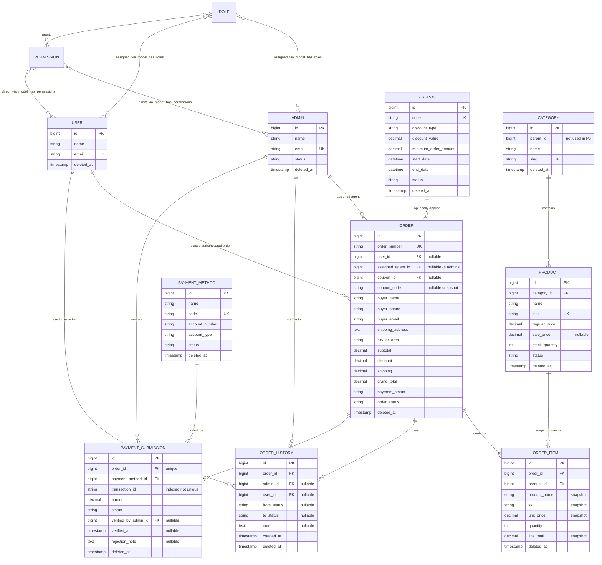

# ShopPilot E-commerce — Database ERD
# শপপাইলট ই-কমার্স — ডেটাবেজ ERD

> **Document:** Logical Database ERD / লজিক্যাল ডেটাবেজ রিলেশনশিপ
> **Project:** ShopPilot E-commerce
> **Source of Truth:** `ShopPilot-database-schema-v2.md` v2.0 and synchronized `ShopPilot-08-DATABASE-SCHEMA.md`
> **Document Version:** 2.0
> **Status:** Canonical ERD — Separate Admin/Customer Authentication
> **Language:** English + Bangla

---

# 1. Purpose

This document defines ShopPilot's logical entities, ownership boundaries, cardinality, and historical relationships. Exact physical columns/types/indexes belong to `ShopPilot-08-DATABASE-SCHEMA.md`.

Core identity split:

```text
Admin / Manager / Agent
→ Admin model
→ admins table
→ admin guard

Customer
→ User model
→ users table
→ web guard

Guest
→ no account row required
→ orders.user_id = NULL
```

---

# 2. Canonical Application Models

```text
Admin
User
Role
Permission
Category
Product
Coupon
PaymentMethod
Order
OrderItem
OrderHistory
PaymentSubmission
```

All of the above are application-owned Eloquent models and use SoftDeletes.

Package/framework persistence outside that model list:

```text
model_has_roles
model_has_permissions
role_has_permissions
media
sessions
password_reset_tokens
notifications
```

No P0 models/tables:

```text
Customer
Guest
Cart
CartItem
ProductVariant
Warehouse
InventoryMovement
PaymentGatewayTransaction
Refund
CourierShipment
```

`Customer` is the business actor represented by `User`; Cart is Session-based.

---

# 3. Identity and RBAC Relationships

```text
ADMIN
├── morphToMany ROLE via model_has_roles
└── morphToMany PERMISSION via model_has_permissions

USER
├── morphToMany ROLE via model_has_roles
└── morphToMany PERMISSION via model_has_permissions

ROLE
├── belongsToMany PERMISSION via role_has_permissions
└── morphToMany ADMIN / USER via model_has_roles

PERMISSION
├── belongsToMany ROLE via role_has_permissions
└── morphToMany ADMIN / USER via model_has_permissions
```

Guard contract:

```text
super_admin / admin / manager / agent → guard_name = admin
customer                              → guard_name = web
```

Do not add `role_id` to `admins` or `users`.

---

# 4. Commerce Relationship Map

```text
CATEGORY
└── hasMany PRODUCTS

PRODUCT
└── belongsTo CATEGORY

USER
├── hasMany ORDERS as authenticated Customer
└── hasMany ORDER_HISTORIES as Customer actor

ADMIN
├── hasMany ORDERS as assigned Agent
├── hasMany ORDER_HISTORIES as staff actor
└── hasMany PAYMENT_SUBMISSIONS as verifier

ORDER
├── belongsTo USER nullable
├── belongsTo ADMIN as assigned Agent nullable
├── belongsTo COUPON nullable
├── hasMany ORDER_ITEMS
├── hasMany ORDER_HISTORIES
└── hasOne PAYMENT_SUBMISSION

ORDER_ITEM
├── belongsTo ORDER
└── belongsTo PRODUCT

ORDER_HISTORY
├── belongsTo ORDER
├── belongsTo ADMIN nullable
└── belongsTo USER nullable

PAYMENT_SUBMISSION
├── belongsTo ORDER
├── belongsTo PAYMENT_METHOD
└── belongsTo ADMIN as verifier nullable
```

---

# 5. Mermaid ER Diagram


```mermaid
erDiagram
    ADMIN ||--o{ ORDER : "assigned agent"
    USER ||--o{ ORDER : "places authenticated order"
    COUPON ||--o{ ORDER : "optionally applied"

    CATEGORY ||--o{ PRODUCT : contains
    ORDER ||--|{ ORDER_ITEM : contains
    PRODUCT ||--o{ ORDER_ITEM : snapshot_source

    ORDER ||--o{ ORDER_HISTORY : has
    ADMIN ||--o{ ORDER_HISTORY : "staff actor"
    USER ||--o{ ORDER_HISTORY : "customer actor"

    ORDER ||--o| PAYMENT_SUBMISSION : has
    PAYMENT_METHOD ||--o{ PAYMENT_SUBMISSION : used_by
    ADMIN ||--o{ PAYMENT_SUBMISSION : verifies

    ROLE }o--o{ ADMIN : assigned_via_model_has_roles
    ROLE }o--o{ USER : assigned_via_model_has_roles
    PERMISSION }o--o{ ADMIN : direct_via_model_has_permissions
    PERMISSION }o--o{ USER : direct_via_model_has_permissions
    ROLE }o--o{ PERMISSION : grants

    ADMIN {
        bigint id PK
        string name
        string email UK
        string status
        timestamp deleted_at
    }

    USER {
        bigint id PK
        string name
        string email UK
        timestamp deleted_at
    }

    CATEGORY {
        bigint id PK
        bigint parent_id "not used in P0"
        string name
        string slug UK
        timestamp deleted_at
    }

    PRODUCT {
        bigint id PK
        bigint category_id FK
        string name
        string sku UK
        decimal regular_price
        decimal sale_price "nullable"
        int stock_quantity
        string status
        timestamp deleted_at
    }

    COUPON {
        bigint id PK
        string code UK
        string discount_type
        decimal discount_value
        decimal minimum_order_amount
        datetime start_date
        datetime end_date
        string status
        timestamp deleted_at
    }

    PAYMENT_METHOD {
        bigint id PK
        string name
        string code UK
        string account_number
        string account_type
        string status
        timestamp deleted_at
    }

    ORDER {
        bigint id PK
        string order_number UK
        bigint user_id FK "nullable"
        bigint assigned_agent_id FK "nullable -> admins"
        bigint coupon_id FK "nullable"
        string coupon_code "nullable snapshot"
        string buyer_name
        string buyer_phone
        string buyer_email
        text shipping_address
        string city_or_area
        decimal subtotal
        decimal discount
        decimal shipping
        decimal grand_total
        string payment_status
        string order_status
        timestamp deleted_at
    }

    ORDER_ITEM {
        bigint id PK
        bigint order_id FK
        bigint product_id FK
        string product_name "snapshot"
        string sku "snapshot"
        decimal unit_price "snapshot"
        int quantity
        decimal line_total "snapshot"
        timestamp deleted_at
    }

    ORDER_HISTORY {
        bigint id PK
        bigint order_id FK
        bigint admin_id FK "nullable"
        bigint user_id FK "nullable"
        string from_status "nullable"
        string to_status "nullable"
        text note "nullable"
        timestamp created_at
        timestamp deleted_at
    }

    PAYMENT_SUBMISSION {
        bigint id PK
        bigint order_id FK "unique"
        bigint payment_method_id FK
        string transaction_id "indexed not unique"
        decimal amount
        string status
        bigint verified_by_admin_id FK "nullable"
        timestamp verified_at "nullable"
        text rejection_note "nullable"
        timestamp deleted_at
    }
```

---

# 6. Order Ownership

Guest Checkout:

```text
orders.user_id = NULL
```

Authenticated Customer Checkout:

```text
orders.user_id = users.id
```

Assigned Agent:

```text
orders.assigned_agent_id = admins.id
```

Agent assignment never changes Customer ownership.

---

# 7. Order History Actor Model

Because staff and customers use different authenticatable models, history uses two nullable actor FKs:

```text
Admin / Manager / Agent action
→ order_histories.admin_id = admins.id
→ order_histories.user_id = NULL

Customer action
→ order_histories.user_id = users.id
→ order_histories.admin_id = NULL

Guest / System action
→ admin_id = NULL
→ user_id = NULL
```

Application logic must not populate both actor columns for one history event.

---

# 8. Payment Verification Ownership

```text
payment_submissions.verified_by_admin_id
→ admins.id
→ nullable until verify/reject
```

Initial submission:

```text
status = submitted
verified_by_admin_id = NULL
verified_at = NULL
```

Authorized verification/rejection stores the Admin-side actor ID from the `admin` guard.

---

# 9. Order Item Snapshot Contract

P0 has no `product_variants` table.

Every OrderItem stores:

```text
product_id
product_name
sku
unit_price
quantity
line_total
```

Historical Order rendering must use snapshot fields rather than depending only on current Product values.

---

# 10. Payment Cardinality

P0 relationship:

```text
Order hasOne PaymentSubmission
PaymentSubmission belongsTo Order
```

Physical enforcement:

```text
UNIQUE(payment_submissions.order_id)
```

`transaction_id` is indexed but not globally unique.

---

# 11. Foreign-Key Matrix

| Child Column | Parent | Nullable | Delete Behavior |
|---|---|---:|---|
| `products.category_id` | `categories.id` | No | RESTRICT |
| `orders.user_id` | `users.id` | Yes | SET NULL |
| `orders.assigned_agent_id` | `admins.id` | Yes | SET NULL |
| `orders.coupon_id` | `coupons.id` | Yes | SET NULL |
| `order_items.order_id` | `orders.id` | No | RESTRICT |
| `order_items.product_id` | `products.id` | No | RESTRICT |
| `order_histories.order_id` | `orders.id` | No | RESTRICT |
| `order_histories.admin_id` | `admins.id` | Yes | SET NULL |
| `order_histories.user_id` | `users.id` | Yes | SET NULL |
| `payment_submissions.order_id` | `orders.id` | No | RESTRICT |
| `payment_submissions.payment_method_id` | `payment_methods.id` | No | RESTRICT |
| `payment_submissions.verified_by_admin_id` | `admins.id` | Yes | SET NULL |

Historical children are never cascade-destroyed.

---

# 12. Status Boundaries

Order status:

```text
pending
confirmed
processing
shipped
delivered
cancelled
```

Order payment status:

```text
unpaid
submitted
verified
rejected
```

PaymentSubmission status:

```text
submitted
verified
rejected
```

Critical invariant:

```text
submitted != verified
```

---

# 13. SoftDelete Contract

Every application-owned model uses SoftDeletes:

```text
Admin
User
Role
Permission
Category
Product
Coupon
PaymentMethod
Order
OrderItem
OrderHistory
PaymentSubmission
```

This does not change historical preservation rules. Normal Order processing must not force-delete or cascade-delete historical rows.

---

# 14. No-P0 Entity Decisions

Do not introduce the following without a later approved scope change:

```text
customers table
carts / cart_items tables
product_variants table
warehouses
inventory_movements
payment_gateway_transactions
refunds
courier_shipments
```

Mappings:

```text
Customer account → users
Staff account    → admins
Cart             → Laravel Session
Stock            → products.stock_quantity
```

---

# 15. ERD Acceptance Checklist

- [ ] Admin/Manager/Agent resolve through `Admin`/`admins`/`admin` guard.
- [ ] Customer resolves through `User`/`users`/`web` guard.
- [ ] Guest requires no account row.
- [ ] `orders.user_id` points only to `users.id`.
- [ ] `orders.assigned_agent_id` points only to `admins.id`.
- [ ] `order_histories.admin_id` and `user_id` model separate actor types.
- [ ] `payment_submissions.verified_by_admin_id` points to `admins.id`.
- [ ] Order hasOne PaymentSubmission.
- [ ] OrderItem has no ProductVariant relation in P0.
- [ ] OrderItem snapshot uses `line_total`.
- [ ] Historical child FKs use RESTRICT/SET NULL, never destructive cascade.
- [ ] Every canonical application-owned model uses SoftDeletes.
- [ ] Physical details match `ShopPilot-08-DATABASE-SCHEMA.md`.
