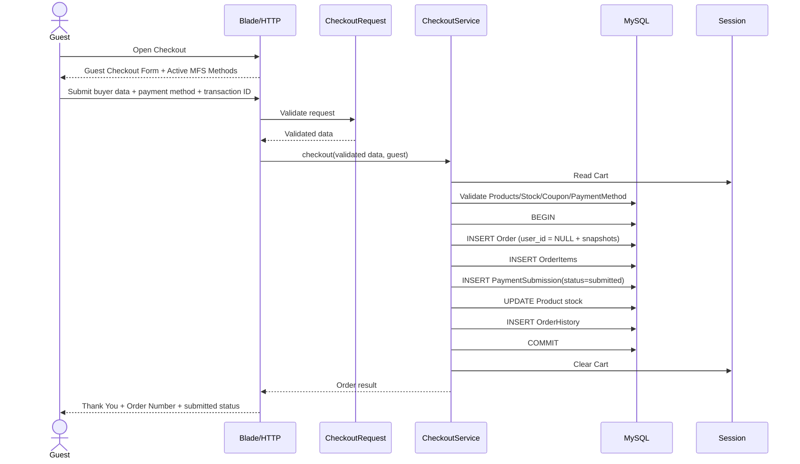
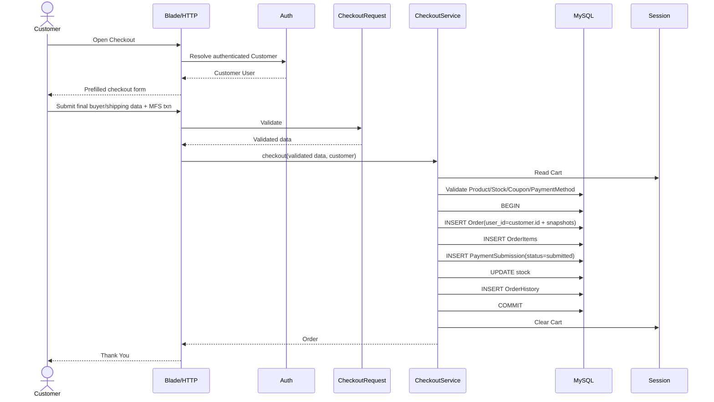
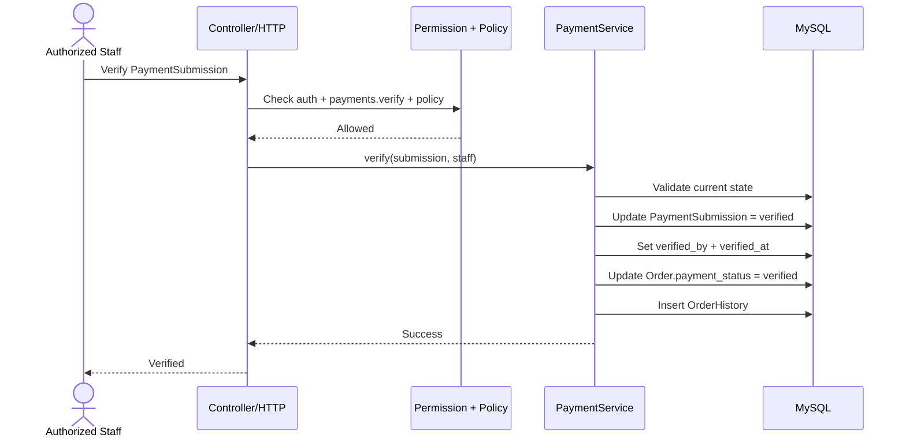
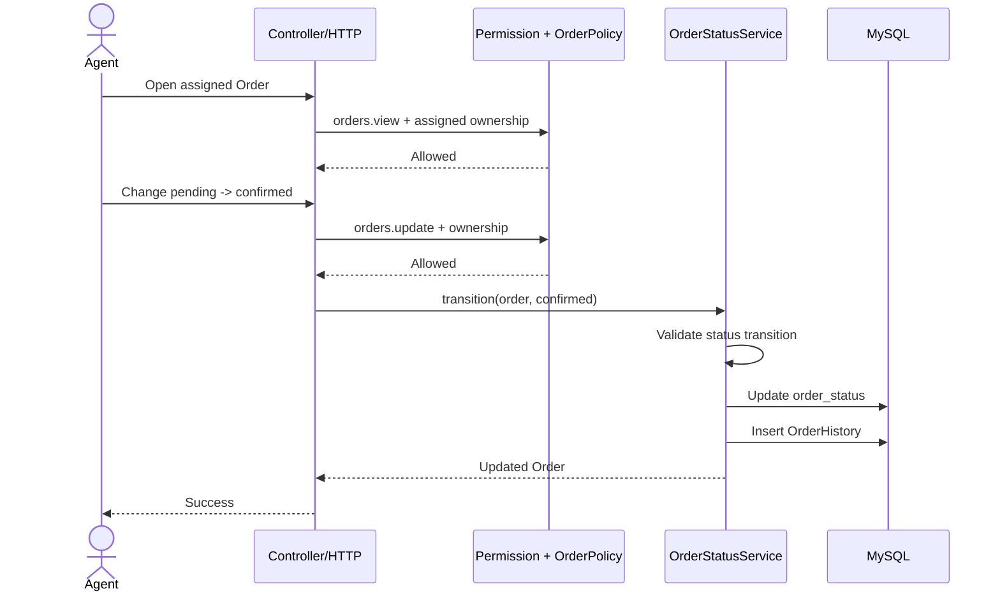
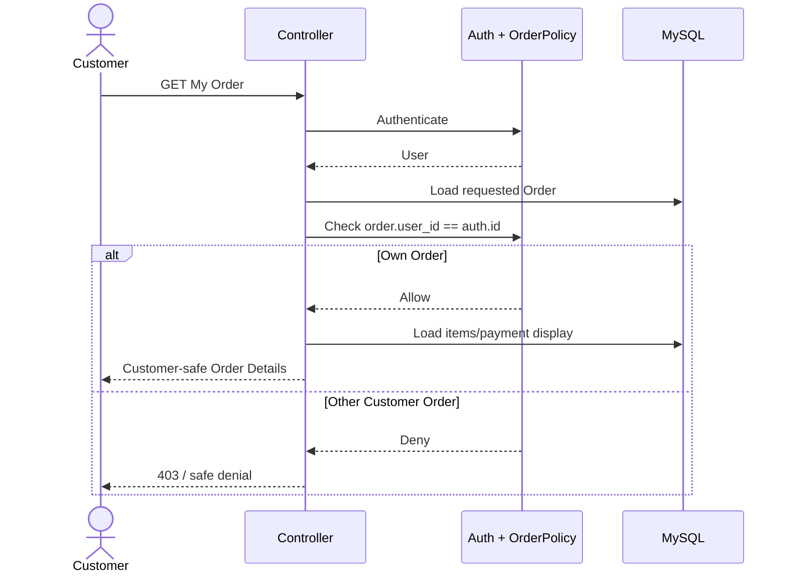
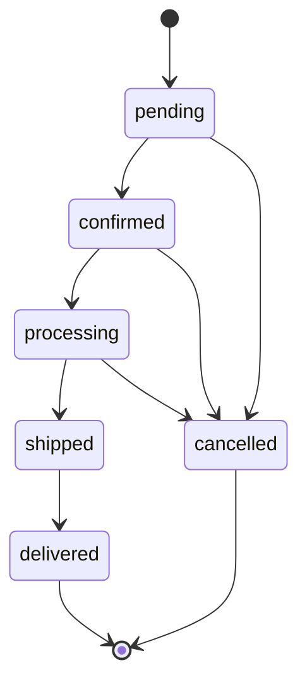
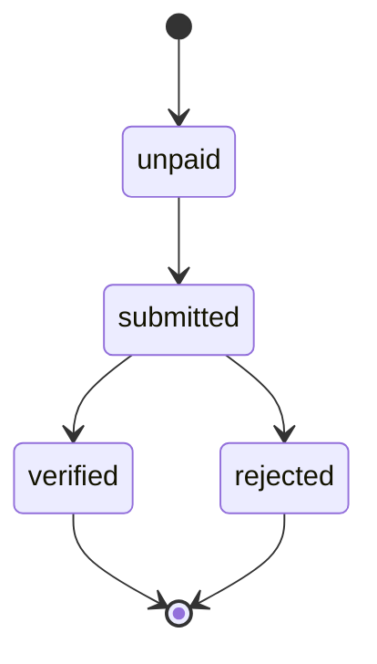

# ShopPilot E-commerce — Application Flow
# শপপাইলট ই-কমার্স — অ্যাপ্লিকেশন ফ্লো

> **Document:** End-to-End Application Flow / সম্পূর্ণ Application Flow  
> **Project:** ShopPilot E-commerce  
> **Source Documents:**  
> `01-PROJECT-OVERVIEW-UPDATED.md` v1.1  
> `ShopPilot-02-PRD.md` v1.0  
> `ShopPilot-03-FEATURES.md` v1.0  
> `ShopPilot-04-USER-ROLES-AND-PERMISSIONS.md` v1.0  
> `ShopPilot-05-BUSINESS-RULES.md` v1.0  
> `ShopPilot-06-ARCHITECTURE.md` v1.0  
> `ShopPilot-07-DATABASE-ERD.md` v1.0  
> `ShopPilot-08-DATABASE-SCHEMA.md` v1.0  
> **Architecture:** Service-Oriented Modular Laravel Monolith  
> **Backend:** PHP + Laravel  
> **Frontend:** Laravel Blade  
> **Database:** MySQL  
> **RBAC:** Spatie Laravel Permission  
> **Media:** Spatie Laravel Media Library  
> **Cart:** Session-Based  
> **Payment:** Manual bKash / Nagad / Rocket Submission  
> **Document Version:** 1.0  
> **Language:** English + Bangla  
> **Status:** Implementation-Ready Application Flow Definition  
> **Next Document:** `10-FOLDER-STRUCTURE.md`

---

# Table of Contents

1. Document Purpose  
2. Flow Authority & Source Precedence  
3. Flow Scope  
4. Actor Model  
5. Flow Notation  
6. Global Flow Principles  
7. Master End-to-End Flow  
8. Public Storefront Entry Flow  
9. Product Discovery Flow  
10. Product Details Flow  
11. Add-to-Cart Flow  
12. Cart Update Flow  
13. Cart Remove / Clear Flow  
14. Coupon Application Flow  
15. Coupon Failure Flow  
16. Checkout Entry Flow  
17. Checkout Choice Flow  
18. Buyer Context Resolution  
19. Guest Checkout Flow  
20. Logged-in Customer Checkout Flow  
21. Checkout Prefill Flow  
22. Checkout Validation Pipeline  
23. Manual Payment Instruction Flow  
24. Transaction ID Submission Flow  
25. Checkout Transaction Flow  
26. Checkout Database Write Sequence  
27. Checkout Commit Flow  
28. Checkout Rollback Flow  
29. Stock Validation / Deduction Flow  
30. Coupon Snapshot Flow  
31. Buyer Snapshot Flow  
32. Product Snapshot Flow  
33. Payment Submission Creation Flow  
34. Initial Order History Flow  
35. Cart Clear Flow  
36. Thank You Flow  
37. Guest Post-Checkout Flow  
38. Logged-in Customer Post-Checkout Flow  
39. Customer My Orders Flow  
40. Customer Order Details Flow  
41. Customer Ownership Denial Flow  
42. Admin Authentication / Dashboard Flow  
43. Manager Authentication / Dashboard Flow  
44. Agent Authentication / Dashboard Flow  
45. Role-Aware Dashboard Flow  
46. Protected Backoffice Request Flow  
47. Permission + Policy Denial Flow  
48. Admin Order Management Flow  
49. Payment Review Queue Flow  
50. Payment Verification Flow  
51. Payment Rejection Flow  
52. Payment State Synchronization Flow  
53. Order Assignment Flow  
54. Agent Assigned-Order Access Flow  
55. Cross-Agent Denial Flow  
56. Order Status Transition Flow  
57. Normal Fulfillment Flow  
58. Cancellation Flow  
59. Invalid Transition Flow  
60. Order History Recording Flow  
61. Internal Note Flow  
62. Product Management Flow  
63. Product Media Flow  
64. Category Management Flow  
65. Stock Management Flow  
66. Coupon Management Flow  
67. Payment Method Management Flow  
68. Soft Delete Flow  
69. Restore Flow  
70. Dashboard Data Flow  
71. Search Flow  
72. Console Command Flow  
73. Optional Queue Flow  
74. Form Request / Validation Failure Flow  
75. Security & Mass-Assignment Flow  
76. Error / Exception Flow  
77. Database Constraint Failure Flow  
78. Session Flow  
79. Historical Data Flow  
80. Guest vs Customer Comparison  
81. Order vs Payment State Separation  
82. Parallel Backoffice Lanes  
83. Explicit TBD Flow Decisions  
84. Out-of-Scope Flows  
85. Sequence Diagram — Guest Checkout  
86. Sequence Diagram — Authenticated Checkout  
87. Sequence Diagram — Payment Verification  
88. Sequence Diagram — Agent Processing  
89. Sequence Diagram — Customer Own Order  
90. State Diagram — Order  
91. State Diagram — Payment  
92. Flow-to-Service Mapping  
93. Flow-to-Policy Mapping  
94. Flow-to-Request Mapping  
95. Flow-to-Database Mapping  
96. Critical Failure Matrix  
97. Critical Test Scenarios  
98. Application Flow Acceptance Criteria  
99. Definition of Application Flow Complete  
100. Final Application Flow Summary  
101. Next Documentation

---

# 1. Document Purpose

This document defines **how a request moves through ShopPilot from user interaction to business logic, database persistence, backoffice processing, and final response**.

এই document-এর কাজ:

- Guest এবং logged-in Customer flow আলাদা করা
- public browsing থেকে Order পর্যন্ত full purchase journey define করা
- session Cart flow define করা
- Coupon validation flow define করা
- manual bKash/Nagad/Rocket payment flow define করা
- Checkout transaction-এর exact write order define করা
- `submitted != verified` flow preserve করা
- Admin/Manager payment verification flow define করা
- Manager/Admin → Agent assignment flow define করা
- Agent assigned-order-only workflow define করা
- Order state transition flow define করা
- Customer own-order access flow define করা
- denial/error/rollback flow define করা
- SoftDelete / Restore flow define করা
- Services, Policies, Form Requests, Rules, Enums এবং database-এর flow placement define করা

This file describes **behavioral sequence**.

It does not define final physical folder/file placement.

That belongs to:

```text
10-FOLDER-STRUCTURE.md
```

---

# 2. Flow Authority & Source Precedence

Application Flow must preserve:

```text
05-BUSINESS-RULES.md
        ↓
06-ARCHITECTURE.md
        ↓
07-DATABASE-ERD.md
        ↓
08-DATABASE-SCHEMA.md
        ↓
09-APPLICATION-FLOW.md
```

Rules:

1. Business Rules define **what is allowed**.
2. Architecture defines **which layer owns the action**.
3. ERD defines **logical relationships**.
4. Database Schema defines **physical persistence**.
5. Application Flow defines **the execution sequence**.

If a business behavior is still TBD:

```text
09-APPLICATION-FLOW.md must not invent a mandatory behavior.
```

---

# 3. Flow Scope

P0 flows covered:

```text
Authentication
Public Storefront
Search
Product Details
Session Cart
Coupon
Guest Checkout
Authenticated Checkout
Manual MFS Payment
Payment Submission
Order Creation
Stock Deduction
Buyer Snapshot
Product Snapshot
Thank You
Customer My Orders
Payment Verification
Order Assignment
Agent Processing
Order Status
Order History
Category/Product/Stock/Coupon Admin Flows
Payment Method Configuration
SoftDelete
Restore
Dashboard
Authorization
Validation
Error / Denial
Console Command
Optional Queue Boundary
```

---

# 4. Actor Model

Approved actors:

```text
Guest Customer / Visitor
Logged-in Customer
Admin
Manager
Agent
System
```

## Guest Customer

Public actor.

Has:

```text
No authenticated User requirement
No Spatie Role
No Spatie Permission
```

Can still:

```text
Browse
Search
Use Cart
Apply Coupon
Checkout
Submit Transaction ID
Place Order
View Thank You
```

---

## Logged-in Customer

Authenticated `users` record with Customer role/context.

Can:

```text
Use public shopping
Checkout
View My Account
View My Orders
View Own Order Details
```

---

## Admin

Sensitive owner by default.

---

## Manager

Permission-driven operational actor.

---

## Agent

Assigned-Order processing actor.

---

## System

Internal application processes such as:

```text
Console Command
Observer
Scheduler
Optional Queue Job
```

System actor must still follow approved business rules.

---

# 5. Flow Notation

```text
↓        next step
→        action/result
[IF]     condition
[DENY]   authorization failure
[FAIL]   validation/business failure
[DB]     persistence operation
[SESSION] session operation
[TBD]    intentionally unresolved behavior
```

---

# 6. Global Flow Principles

All flows must respect:

```text
Server is authoritative for:
- Price
- Discount
- Stock
- Payment Status
- Order Status
- Role
- Permission
- Agent Assignment
- Resource Ownership
```

Frontend/Blade may display or hide controls but cannot be the security boundary.

Protected action sequence:

```text
Authentication
    ↓
Role / Permission
    ↓
Policy / Resource Ownership
    ↓
Business Rule
    ↓
Validation
    ↓
Service
    ↓
Model / Database
    ↓
Response
```

Guest public actions skip authenticated RBAC where authentication is not required, but still use:

```text
Validation
Business Rules
Service Logic
Server-Side Calculation
```

---

# 7. Master End-to-End Flow

```text
Guest / Logged-in Customer
        ↓
Home / Shop / Search
        ↓
Category / Product Details
        ↓
Add To Cart
        ↓
Session Cart
        ↓
Apply Coupon (Optional)
        ↓
Checkout
        ↓
Resolve Buyer Context
        ├── Guest
        └── Authenticated Customer
        ↓
Validate:
Cart
Stock
Coupon
Server Price
Buyer Details
Payment Method
Transaction ID
        ↓
Show Manual Payment Instruction
        ↓
Customer Pays Externally
        ↓
Submit Transaction ID
        ↓
Atomic Checkout Transaction
        ├── Create Order
        ├── Create Order Items
        ├── Create Payment Submission
        ├── Deduct Stock
        └── Create Initial Order History
        ↓
COMMIT
        ↓
Clear Session Cart
        ↓
Thank You
        ↓
Backoffice Operations
        ├── Payment Review Lane
        │      ├── Verify
        │      └── Reject
        │
        └── Fulfillment Lane
               ├── Assign Agent
               ├── Confirm
               ├── Processing
               ├── Shipped
               └── Delivered
```

Important:

```text
Payment Review Lane
and
Fulfillment Lane
```

exist as separate state/process dimensions.

Current source documents do **not** define a mandatory global rule that one must always finish before the other begins.

---

# 8. Public Storefront Entry Flow

```text
Visitor / Customer
        ↓
Public Route
        ↓
Load Active / Visible Storefront Data
        ↓
Blade View
```

Public pages:

```text
Home
Shop
Category
Product Details
Search Results
Cart
Checkout
Payment Instruction
Thank You after successful checkout
Login
Register
```

Normal Storefront must hide:

```text
Inactive Products
Soft-Deleted Products
```

---

# 9. Product Discovery Flow

```text
Visitor
   ↓
Home / Shop
   ↓
Search OR Category Filter
   ↓
Query Products
   ↓
Apply Storefront Visibility Rules
   ↓
Paginated Product Result
   ↓
Blade Product Grid/List
```

Optional filters/sorting remain limited to approved features.

No variant inventory flow.

---

# 10. Product Details Flow

```text
Request Product Slug
        ↓
Find Product
        ↓
[IF soft-deleted]
        → Not Found / unavailable

[IF inactive]
        → Not available in normal Storefront

[ELSE]
        ↓
Load Category
Load Media
Load Stock
        ↓
Render Product Details
```

Display stock is informative.

Checkout performs final server-side stock validation again.

---

# 11. Add-to-Cart Flow

```text
Guest / Customer
        ↓
Submit Product + Quantity
        ↓
CartService
        ↓
Load Product from DB
        ↓
Validate:
- Product exists
- Product active
- Product not deleted
- Quantity valid
        ↓
Server resolves current price reference
        ↓
[SESSION] Add / merge Cart item
        ↓
Recalculate Cart presentation
        ↓
Return Cart / success response
```

Client-supplied price is never authoritative.

---

# 12. Cart Update Flow

```text
Cart Page
   ↓
Submit new quantity
   ↓
Validate quantity
   ↓
Load authoritative Product state
   ↓
Update Session Cart
   ↓
Recalculate subtotal
   ↓
Revalidate applied Coupon if required
   ↓
Recalculate discount
   ↓
Recalculate grand total
   ↓
Render Cart
```

Checkout still revalidates everything again.

---

# 13. Cart Remove / Clear Flow

## Remove Item

```text
Cart
 ↓
Remove Item Request
 ↓
CartService
 ↓
[SESSION] Remove Product
 ↓
Recalculate Totals
 ↓
Revalidate Coupon
 ↓
Render Updated Cart
```

## Clear Cart

```text
Cart
 ↓
Clear
 ↓
[SESSION] Remove Cart items + coupon context as appropriate
 ↓
Empty Cart State
```

Successful Checkout clears Cart only **after transaction commit**.

---

# 14. Coupon Application Flow

```text
Guest / Customer
        ↓
Enter Coupon Code
        ↓
CouponService / ValidCoupon
        ↓
Find Coupon
        ↓
Validate:
- Exists
- Not soft-deleted
- Active
- Within start/end dates
- Minimum order amount satisfied
        ↓
Calculate Discount Server-Side
        ↓
[SESSION] Store applied Coupon context
        ↓
Recalculate Cart Total
        ↓
Display Discount
```

Rules:

```text
One Coupon Per Order
No Stacking
Server-Side Calculation
```

---

# 15. Coupon Failure Flow

```text
Coupon Submitted
   ↓
Validate
   ↓
[IF invalid]
[IF inactive]
[IF expired]
[IF minimum amount not met]
        ↓
Reject Coupon
        ↓
Do not apply discount
        ↓
Return validation/business error
```

No Order should be created from an invalid Checkout state.

---

# 16. Checkout Entry Flow

```text
Cart
 ↓
Checkout
 ↓
[IF cart empty]
    → Block Checkout
    → Return Cart/Checkout validation error

[ELSE]
    ↓
Resolve Buyer Context
```

---

# 17. Checkout Choice Flow

Conceptual user flow:

```text
Checkout Choice
    ├── Continue as Guest
    └── Login / Register / Already Logged In
```

Important:

Guest Checkout must not force registration.

---

# 18. Buyer Context Resolution

```text
CheckoutService
    ↓
Check authenticated User
    ↓
[IF authenticated Customer]
    → Buyer Type = Customer
    → user_id = auth()->id()

[ELSE]
    → Buyer Type = Guest
    → user_id = null
```

Staff roles are not automatically treated as Customer purchase context unless explicitly designed elsewhere.

Core buyer actors are:

```text
Guest
Authenticated Customer
```

---

# 19. Guest Checkout Flow

```text
Guest
 ↓
Checkout
 ↓
No Login Required
 ↓
Enter:
- Name
- Phone
- Email
- Address
- City / Area
- Optional Order Note
 ↓
Select Active Payment Method
 ↓
View MFS Number / Instruction
 ↓
Pay Externally
 ↓
Enter Transaction ID
 ↓
CheckoutRequest + Business Validation
 ↓
CheckoutService
 ↓
Atomic Checkout Transaction
 ↓
Order:
user_id = NULL
buyer snapshot = submitted values
 ↓
Thank You
```

Guest receives no authenticated My Orders dashboard.

---

# 20. Logged-in Customer Checkout Flow

```text
Authenticated Customer
        ↓
Checkout
        ↓
Profile Data May Prefill
        ↓
Customer May Edit Final Delivery Data
        ↓
Select Payment Method
        ↓
External MFS Payment
        ↓
Enter Transaction ID
        ↓
Validate
        ↓
CheckoutService
        ↓
Atomic Checkout Transaction
        ↓
Order:
user_id = auth()->id()
buyer snapshot = final checkout values
        ↓
Thank You
        ↓
Order later available in My Orders
```

Important:

```text
User relation != historical snapshot
```

Both are persisted.

---

# 21. Checkout Prefill Flow

```text
Authenticated Customer
        ↓
Load User Profile
        ↓
Prefill Checkout Form
        ↓
Customer edits if needed
        ↓
Submit
        ↓
Validate final submitted values
        ↓
Store final values as Order snapshot
```

Updating checkout fields does not necessarily mean updating User profile.

That is a separate profile action.

---

# 22. Checkout Validation Pipeline

Approved sequence:

```text
Resolve Buyer Context
        ↓
Cart Validation
        ↓
Stock Validation
        ↓
Coupon Validation
        ↓
Server Price Calculation
        ↓
Customer / Buyer Details Validation
        ↓
Payment Method Validation
        ↓
Transaction ID Validation
        ↓
Order Transaction
```

Validation responsibility:

```text
CheckoutRequest
Custom Rules
Services
Database Constraints
```

No single layer replaces all others.

---

# 23. Manual Payment Instruction Flow

```text
Checkout
   ↓
Customer selects:
bKash / Nagad / Rocket
   ↓
Server loads active PaymentMethod
   ↓
Display:
- Method Name
- Account Number
- Account Type
- Instruction
   ↓
Customer pays outside ShopPilot
```

No real provider callback occurs.

---

# 24. Transaction ID Submission Flow

```text
Customer completes external payment
        ↓
Enter Transaction ID
        ↓
ValidManualTransactionId
        ↓
Validate required/basic format
        ↓
Continue Checkout
```

Important invariant:

```text
Format validation
!=
Provider verification
```

Transaction ID is not automatically verified proof.

---

# 25. Checkout Transaction Flow

`CheckoutService` owns orchestration.

```text
Validated Checkout Input
        ↓
DB::transaction(...)
        ↓
Re-read / confirm critical Product state
        ↓
Revalidate Stock
        ↓
Recalculate authoritative totals
        ↓
Create Order
        ↓
Create Order Items
        ↓
Create Payment Submission
        ↓
Deduct Product Stock
        ↓
Create Initial Order History
        ↓
COMMIT
```

If any required write fails:

```text
ROLLBACK
```

---

# 26. Checkout Database Write Sequence

Exact P0 persistent write set:

```text
BEGIN TRANSACTION

1. INSERT orders
2. INSERT order_items
3. INSERT payment_submissions
4. UPDATE products.stock_quantity
5. INSERT initial order_histories

COMMIT
```

This sequence persists:

```text
Order aggregate
Product snapshots
Buyer snapshots
Payment proof submission
Stock mutation
Traceability
```

---

# 27. Checkout Commit Flow

```text
All transaction writes succeed
        ↓
COMMIT
        ↓
Order ID / Order Number becomes successful result
        ↓
Clear Session Cart
        ↓
Redirect to Thank You
```

Do not clear Cart before successful commit.

---

# 28. Checkout Rollback Flow

```text
Transaction starts
    ↓
Any exception / required write failure
    ↓
ROLLBACK
    ↓
No partial Order success
    ↓
Cart remains available where possible
    ↓
Return safe error / validation state
```

Must avoid partial combinations such as:

```text
Order exists
but
OrderItems missing
```

or:

```text
Stock deducted
but
Order failed
```

---

# 29. Stock Validation / Deduction Flow

```text
Checkout
   ↓
Load Product(s)
   ↓
Validate requested quantity <= stock_quantity
   ↓
[IF insufficient]
    → Reject Checkout
    → No Order Commit

[ELSE]
   ↓
Inside Transaction:
Reload / confirm Product state
   ↓
Revalidate Stock
   ↓
Deduct Quantity
   ↓
Persist stock_quantity
```

P0 source:

```text
products.stock_quantity
```

No inventory ledger.

---

# 30. Coupon Snapshot Flow

P0 physical schema persists:

```text
orders.coupon_id
orders.coupon_code
orders.discount
```

Flow:

```text
Valid Coupon
    ↓
Server calculates discount
    ↓
Checkout succeeds
    ↓
Order stores:
- coupon_id
- coupon_code snapshot
- discount amount snapshot
```

If no Coupon:

```text
coupon_id = null
coupon_code = null
discount = 0.00
```

---

# 31. Buyer Snapshot Flow

For both Guest and Customer:

```text
Final Checkout Values
        ↓
Order Snapshot
        ├── buyer_name
        ├── buyer_phone
        ├── buyer_email
        ├── shipping_address
        └── city_or_area
```

Later User profile change must not rewrite old Order snapshot.

---

# 32. Product Snapshot Flow

For every purchased line:

```text
Current Product at Checkout
        ↓
OrderItem Snapshot
        ├── product_id
        ├── product_name
        ├── sku
        ├── unit_price
        ├── quantity
        └── line_total
```

Later Product name/price change must not rewrite old OrderItem snapshot.

---

# 33. Payment Submission Creation Flow

```text
Validated Manual Payment Input
        ↓
Create PaymentSubmission
        ↓
order_id = created Order
payment_method_id = selected active method
transaction_id = submitted value
amount = applicable submitted amount
status = submitted
verified_by = null
verified_at = null
```

P0 cardinality:

```text
One Order → zero or one PaymentSubmission
```

Physical enforcement:

```text
UNIQUE(payment_submissions.order_id)
```

---

# 34. Initial Order History Flow

Successful Checkout creates initial trace.

Example:

```text
Order Created
Payment Submitted
```

Implementation may use one or more history notes/events according to existing model, but must preserve meaningful traceability.

Order-status event can include:

```text
from_status
to_status
```

Non-status event may use:

```text
note
```

with nullable transition fields.

---

# 35. Cart Clear Flow

```text
Checkout COMMIT succeeds
        ↓
CartService clear
        ↓
Remove Cart items
        ↓
Remove applied Coupon session context
        ↓
Redirect Thank You
```

[FAIL] Checkout:

```text
Do not clear Cart as successful checkout.
```

---

# 36. Thank You Flow

```text
Successful committed Checkout
        ↓
Thank You Page
```

May display:

```text
Order Success
Order Number
Basic Order Summary
Payment Submission Status
```

Correct meaning:

```text
Order + payment information submission succeeded
```

Incorrect meaning:

```text
Provider-confirmed payment succeeded
```

Recommended message:

> Order placed successfully. Your payment information has been submitted for verification.

---

# 37. Guest Post-Checkout Flow

```text
Guest Order Created
        ↓
Thank You
        ↓
No authenticated My Orders
```

P0 does not provide Guest tracking dashboard.

Future/P1 may introduce secure Guest tracking.

Never expose arbitrary Guest Order through sequential ID without secure verification.

---

# 38. Logged-in Customer Post-Checkout Flow

```text
Customer Order Created
        ↓
Thank You
        ↓
My Account
        ↓
My Orders
        ↓
Own Order Details
```

Order lookup must remain scoped to:

```text
order.user_id == auth()->id()
```

---

# 39. Customer My Orders Flow

```text
Authenticated Customer
        ↓
My Orders Route
        ↓
Authentication
        ↓
Query:
orders.user_id = auth()->id()
        ↓
Paginated Customer Orders
        ↓
Blade List
```

Guest:

```text
No My Orders route access as Customer account feature.
```

---

# 40. Customer Order Details Flow

```text
Customer requests Order
        ↓
Authenticate
        ↓
OrderPolicy
        ↓
Check ownership
        ↓
[IF order.user_id == auth()->id()]
    → Load Order
    → Load OrderItems
    → Load payment display state
    → Render customer-safe details

[ELSE]
    → DENY
```

Customer view must exclude:

```text
internal_note
staff-only controls
payment verification controls
agent assignment controls
```

---

# 41. Customer Ownership Denial Flow

```text
Customer A
    ↓
Requests Customer B Order
    ↓
Authentication passes
    ↓
Policy ownership fails
    ↓
DENY
    ↓
403 / safe not-authorized response
```

Direct ID manipulation must not bypass Policy.

---

# 42. Admin Authentication / Dashboard Flow

```text
Admin
 ↓
Login
 ↓
Authentication
 ↓
Admin Role / Permissions
 ↓
DashboardService
 ↓
Aggregate authorized metrics
 ↓
Admin Dashboard
```

Metrics may include:

```text
Total Sales
Total Orders
Pending Orders
Delivered Orders
Cancelled Orders
Total Customers
Total Products
Low Stock
Pending Payment Verification
Recent Orders
```

---

# 43. Manager Authentication / Dashboard Flow

```text
Manager
 ↓
Login
 ↓
Authentication
 ↓
Manager Role
 ↓
Permission Checks
 ↓
DashboardService
 ↓
Manager Dashboard
```

Possible metrics:

```text
Today's Orders
Pending
Processing
Delivered
Unassigned Orders
Agents
Low Stock
```

Manager capability remains permission-driven.

---

# 44. Agent Authentication / Dashboard Flow

```text
Agent
 ↓
Login
 ↓
Authentication
 ↓
Agent Role
 ↓
dashboard.view
 ↓
DashboardService
 ↓
Query Assigned Orders Only
 ↓
Agent Dashboard
```

Metrics:

```text
My Orders
Pending
Confirmed
Processing
Shipped
Delivered
Cancelled
```

---

# 45. Role-Aware Dashboard Flow

```text
Authenticated User
        ↓
Resolve Role / Context
        ↓
Admin
    → Admin Dashboard

Manager
    → Manager Dashboard

Agent
    → Agent Dashboard

Customer
    → Customer Account

Guest
    → Public Storefront
```

Exact route filenames belong to later implementation/folder/route design.

---

# 46. Protected Backoffice Request Flow

Canonical protected request:

```text
HTTP Request
    ↓
Authentication Middleware
    ↓
Permission Middleware / Gate
    ↓
Policy / Resource Ownership
    ↓
Form Request Validation
    ↓
Business Rule / Custom Rule
    ↓
Service
    ↓
Model / DB
    ↓
Redirect / Blade Response
```

Example:

```text
Manager assigns Agent
    ↓
auth
    ↓
orders.assign
    ↓
OrderPolicy / resource access
    ↓
AssignOrderRequest
    ↓
OrderAssignmentService
    ↓
Order update + History
```

---

# 47. Permission + Policy Denial Flow

```text
Protected Request
        ↓
Authentication?
        ├── No → login/unauthorized
        └── Yes
             ↓
Permission?
        ├── No → DENY
        └── Yes
             ↓
Policy / Ownership?
        ├── No → DENY
        └── Yes
             ↓
Business Rule?
        ├── Fail → reject action
        └── Pass → continue
```

Frontend hidden button is never enough.

---

# 48. Admin Order Management Flow

```text
Authorized Admin
        ↓
Orders List
        ↓
Filter / Open Order
        ↓
View:
- Buyer Snapshot
- Order Items
- Totals
- Payment Status
- Order Status
- Assignment
- History
- Internal Note
        ↓
Perform allowed operational action
```

Every mutation still follows Business Rules.

Admin cannot bypass invalid state transitions just because Admin is highest role.

---

# 49. Payment Review Queue Flow

```text
Authorized Staff
        ↓
Pending Payment Verification
        ↓
Query PaymentSubmissions:
status = submitted
        ↓
Open Submission
        ↓
View:
- Order
- Payment Method
- Transaction ID
- Amount
- Buyer / Order context
        ↓
Choose:
Verify
OR
Reject
```

Default authorities:

```text
Admin → verify + reject
Manager → verify
Agent → none
Customer → none
Guest → none
```

Manager reject requires explicit permission if granted.

---

# 50. Payment Verification Flow

```text
Staff selects Verify
        ↓
Authentication
        ↓
payments.verify
        ↓
PaymentSubmissionPolicy
        ↓
VerifyPaymentRequest
        ↓
PaymentService
        ↓
Validate current submission state
        ↓
Update PaymentSubmission:
status = verified
verified_by = staff id
verified_at = now()
        ↓
Update Order:
payment_status = verified
        ↓
Create OrderHistory trace
        ↓
Success response
```

Do not automatically change:

```text
order_status
```

unless a later approved business rule requires it.

---

# 51. Payment Rejection Flow

```text
Staff selects Reject
        ↓
Authentication
        ↓
payments.reject
        ↓
PaymentSubmissionPolicy
        ↓
Validate current state
        ↓
Collect / Validate rejection note if required by UI/business action
        ↓
PaymentService
        ↓
Update PaymentSubmission:
status = rejected
verified_by = staff id
verified_at = now()
rejection_note = ...
        ↓
Update Order:
payment_status = rejected
        ↓
Create History trace
        ↓
Success response
```

Important:

```text
Rejected payment
does NOT automatically define Order fulfillment status in current approved rules.
```

---

# 52. Payment State Synchronization Flow

P0 service responsibility:

```text
PaymentSubmission State
        +
Order.payment_status
        ↓
PaymentService keeps them consistent
```

Expected mapping:

```text
Submission created
→ submission.status = submitted
→ order.payment_status = submitted

Verified
→ submission.status = verified
→ order.payment_status = verified

Rejected
→ submission.status = rejected
→ order.payment_status = rejected
```

No database trigger.

---

# 53. Order Assignment Flow

```text
Unassigned Order
assigned_agent_id = null
        ↓
Admin / Manager opens Order
        ↓
Authentication
        ↓
orders.assign
        ↓
Policy
        ↓
AssignOrderRequest
        ↓
Validate selected User exists
        ↓
Validate selected User is eligible Agent
        ↓
OrderAssignmentService
        ↓
orders.assigned_agent_id = Agent User ID
        ↓
Create OrderHistory:
Assigned To Agent
        ↓
Agent Dashboard now includes Order
```

Authorized reassignment is allowed where approved.

---

# 54. Agent Assigned-Order Access Flow

```text
Agent requests Order
        ↓
Authentication
        ↓
orders.view
        ↓
OrderPolicy
        ↓
Check:
order.assigned_agent_id == auth()->id()
        ↓
[PASS]
Load assigned Order
        ↓
Show delivery data necessary for fulfillment
```

Agent does not gain global Customer directory access.

---

# 55. Cross-Agent Denial Flow

```text
Agent A
   ↓
Requests Order assigned to Agent B
   ↓
orders.view may exist
   ↓
Ownership Policy checks assigned_agent_id
   ↓
Mismatch
   ↓
DENY
```

Permission alone does not bypass assignment ownership by default.

---

# 56. Order Status Transition Flow

```text
Authorized Staff / Assigned Agent
        ↓
Request New Order Status
        ↓
Authentication
        ↓
Required Permission
        ↓
OrderPolicy
        ↓
UpdateOrderStatusRequest
        ↓
ValidOrderStatusTransition
        ↓
OrderStatusService
        ↓
Validate current → target state
        ↓
Update orders.order_status
        ↓
Create OrderHistory
        ↓
Return updated Order
```

---

# 57. Normal Fulfillment Flow

Approved normal state path:

```text
pending
   ↓
confirmed
   ↓
processing
   ↓
shipped
   ↓
delivered
```

Each transition:

```text
Validate
Update
Record History
```

Do not jump states unless approved Service/Rule allows it.

---

# 58. Cancellation Flow

Approved cancellation sources:

```text
pending
confirmed
processing
```

to:

```text
cancelled
```

Flow:

```text
Authorized Actor
        ↓
Request Cancel
        ↓
Permission + Policy
        ↓
OrderStatusService
        ↓
Check cancellation allowed from current state
        ↓
[IF allowed]
    order_status = cancelled
    history recorded

[ELSE]
    reject
```

[TBD]:

```text
Stock restoration after cancellation
```

must not be silently automated.

---

# 59. Invalid Transition Flow

Example:

```text
delivered
   ↓
request pending
   ↓
ValidOrderStatusTransition
   ↓
FAIL
   ↓
No DB state mutation
   ↓
Return business validation error
```

---

# 60. Order History Recording Flow

Events to trace may include:

```text
Order Created
Payment Submitted
Payment Verified
Payment Rejected
Assigned To Agent
Confirmed
Processing
Shipped
Delivered
Cancelled
```

Flow:

```text
Business Action succeeds
        ↓
OrderHistory row created
        ↓
order_id
user_id nullable
from_status nullable
to_status nullable
note
created_at
```

History should be preserved.

---

# 61. Internal Note Flow

```text
Authorized Staff / Assigned Agent
        ↓
Open authorized Order
        ↓
Add Internal Note
        ↓
Validate
        ↓
Save internal_note or approved note mechanism
        ↓
Customer/public views must not expose it
```

Customer cannot see staff Internal Notes.

---

# 62. Product Management Flow

```text
Authorized Staff
        ↓
Products Module
        ↓
Authentication
        ↓
products.* permission
        ↓
ProductPolicy
        ↓
StoreProductRequest / UpdateProductRequest
        ↓
ProductService
        ↓
Validate:
- Category
- Name
- SKU
- Price
- Stock
- Status
        ↓
Persist Product
        ↓
Media handling if present
        ↓
Redirect / success
```

Product status:

```text
active
inactive
```

Soft-deleted Product is hidden from Storefront.

---

# 63. Product Media Flow

```text
Authorized Product Action
        ↓
Validate Upload
        ↓
Spatie Media Library
        ↓
Collection:
product_thumbnail
OR
product_gallery
        ↓
Store / Replace / Delete
        ↓
Render Product Media
```

Do not create custom product image table for P0.

---

# 64. Category Management Flow

```text
Authorized Staff
        ↓
Category Module
        ↓
Permission + Policy
        ↓
StoreCategoryRequest / UpdateCategoryRequest
        ↓
Validate
        ↓
Persist Category
        ↓
Optional category_image via Media Library
```

Category structure:

```text
Single-Level
```

---

# 65. Stock Management Flow

Manual staff stock update:

```text
Authorized Staff
        ↓
stock.update
        ↓
Validate Product + Quantity
        ↓
StockService
        ↓
Update products.stock_quantity
```

Checkout stock mutation:

```text
CheckoutService
        ↓
StockService
        ↓
Revalidate + deduct inside transaction
```

No separate stock ledger.

---

# 66. Coupon Management Flow

```text
Authorized Staff
        ↓
Coupon Module
        ↓
Permission + Policy
        ↓
StoreCouponRequest / update validation
        ↓
Persist:
code
type
value
minimum
start
end
status
        ↓
Available to Cart/Checkout when valid
```

Coupon expiration may also be processed by Console Command.

---

# 67. Payment Method Management Flow

```text
Admin / Authorized Staff
        ↓
payment-methods.manage
        ↓
PaymentMethodPolicy
        ↓
Validate:
name
code
account_number
account_type
instruction
status
        ↓
Persist Payment Method
        ↓
Active methods become visible at public Checkout
```

Public visibility of active number/instruction does not grant management permission.

---

# 68. Soft Delete Flow

Applicable entities:

```text
users
categories
products
coupons
orders
payment_methods
```

Flow:

```text
Authorized Delete Action
        ↓
Permission
        ↓
Policy
        ↓
Business Rule
        ↓
Model delete()
        ↓
deleted_at set
        ↓
Record hidden from normal active queries
```

No force delete required for P0.

---

# 69. Restore Flow

```text
Authorized Staff
        ↓
View supported trashed records
        ↓
Restore Permission
        ↓
Policy / Business Rule
        ↓
Model restore()
        ↓
deleted_at = null
        ↓
Resource returns to normal query scope
```

Restoring does not automatically override:

```text
status
stock
other business state
```

unless explicitly handled.

---

# 70. Dashboard Data Flow

```text
Authenticated Actor
        ↓
Role + Permission
        ↓
DashboardController
        ↓
DashboardService
        ↓
Authorized aggregate queries
        ↓
Blade Dashboard
```

Dashboard must not become a mutation/business-rule owner.

---

# 71. Search Flow

```text
Visitor / Customer
        ↓
Search Query
        ↓
Validate / sanitize request input
        ↓
Query active, non-deleted Products
        ↓
Name search
        +
Optional SKU / Category / sorting if implemented
        ↓
Paginate
        ↓
Render Results
```

---

# 72. Console Command Flow

Minimum recommended command:

```text
coupons:expire
```

Flow:

```text
Scheduler / Manual CLI
        ↓
Find active Coupons past end_date
        ↓
Apply approved Coupon state rule
        ↓
Mark inactive / expired
        ↓
Complete
```

System command must still follow business rules.

Optional practice commands:

```text
products:low-stock-report
orders:cleanup-pending
```

must not invent destructive behavior.

---

# 73. Optional Queue Flow

Queue is optional / P1.

Allowed non-critical examples:

```text
Email
Image Conversion
Non-Critical Notification
```

Flow:

```text
Core transaction commits
        ↓
Optional event/job dispatch
        ↓
Queue worker
        ↓
Non-critical side effect
```

Core Checkout must not depend on Queue availability.

---

# 74. Form Request / Validation Failure Flow

```text
HTTP POST / PATCH
        ↓
Form Request
        ↓
Validation
        ↓
[FAIL]
    No Service mutation
    Return validation errors
    Preserve safe user input/session where appropriate

[PASS]
    Continue authorization/business/service flow
```

Do not duplicate the same basic validation inside Controller.

---

# 75. Security & Mass-Assignment Flow

```text
Request Input
        ↓
Form Request validated data
        ↓
Service selects allowed fields
        ↓
Model mutation
```

Never mass-assign trusted server fields directly from client input, such as:

```text
payment_status
order_status
verified_by
assigned_agent_id
grand_total
discount
server price
```

unless the action explicitly authorizes and constructs those values server-side.

---

# 76. Error / Exception Flow

```text
Request
 ↓
Validation / Authorization / Business / DB
 ↓
Failure
 ↓
No unauthorized or partial mutation
 ↓
Log/report as appropriate
 ↓
Return safe user-facing response
```

Do not expose:

```text
Stack trace
Sensitive config
Internal note
Payment method management data
Other Customer Order
```

---

# 77. Database Constraint Failure Flow

Example:

```text
Duplicate order_number
Duplicate product SKU
Invalid FK
Second PaymentSubmission for same Order
```

Flow:

```text
Service mutation
    ↓
DB constraint exception
    ↓
Transaction rollback if inside transaction
    ↓
Application handles safely
    ↓
No partial success message
```

---

# 78. Session Flow

Session is used for:

```text
Authentication session
Cart
Applied Coupon context where applicable
```

Cart persistence lifecycle:

```text
Browse
 ↓
Add Cart
 ↓
Session persists across requests
 ↓
Checkout succeeds
 ↓
Commit
 ↓
Cart cleared
```

No P0 Cart DB table.

---

# 79. Historical Data Flow

Current mutable data:

```text
User Profile
Product
Coupon
PaymentMethod
```

Checkout copies required historical facts to:

```text
Order Snapshot
OrderItem Snapshot
Coupon Snapshot
Financial Totals
PaymentSubmission
OrderHistory
```

Therefore later master-record updates do not rewrite past Order truth.

---

# 80. Guest vs Customer Comparison

| Flow Step | Guest | Logged-in Customer |
|---|---|---|
| Browse | Yes | Yes |
| Search | Yes | Yes |
| Session Cart | Yes | Yes |
| Coupon | Yes | Yes |
| Checkout | Yes | Yes |
| Login required | No | Already authenticated |
| Buyer form | Direct input | Profile may prefill |
| Edit final delivery info | Yes | Yes |
| `orders.user_id` | `NULL` | Customer User ID |
| Buyer snapshot | Required | Required |
| MFS Transaction ID | Required | Required |
| Thank You | Yes | Yes |
| My Orders | No P0 | Yes |
| Own Order Policy | N/A to dashboard | Required |

---

# 81. Order vs Payment State Separation

Order fulfillment state:

```text
pending
confirmed
processing
shipped
delivered
cancelled
```

Payment state:

```text
unpaid
submitted
verified
rejected
```

They are independent dimensions.

Example valid representation under current schema:

```text
Order:
order_status = pending
payment_status = submitted
```

Later:

```text
order_status = processing
payment_status = verified
```

Exact mandatory coupling is not fully defined by source rules.

---

# 82. Parallel Backoffice Lanes

After committed Checkout:

```text
                    Order Created
                         ↓
         ┌───────────────┴───────────────┐
         ↓                               ↓
PAYMENT REVIEW LANE              FULFILLMENT LANE
         ↓                               ↓
submitted                       unassigned/pending
         ↓                               ↓
staff review                    assign Agent
    ┌────┴────┐                         ↓
    ↓         ↓                     confirmed
verified   rejected                    ↓
                                      processing
                                         ↓
                                       shipped
                                         ↓
                                      delivered
```

Important:

Current approved rules do not establish a mandatory order like:

```text
Payment must verify before assignment
```

or:

```text
Payment must verify before processing
```

Therefore this document does not invent that dependency.

---

# 83. Explicit TBD Flow Decisions

The following remain intentionally unresolved.

## TBD-001 — Shipping Calculation

Known:

```text
orders.shipping exists
default may be 0.00
```

Unknown:

```text
flat rate?
city based?
free shipping threshold?
```

Do not invent.

---

## TBD-002 — Stock Restore After Cancellation

Known:

```text
Checkout deducts stock.
```

Unknown:

```text
Should cancel automatically restore stock?
At what states?
Exactly once?
```

Do not automate until approved.

---

## TBD-003 — Rejected Payment Impact on Order Status

Known:

```text
payment_status → rejected
```

Unknown:

```text
Should order_status remain pending?
Auto-cancel?
Allow resubmission?
```

Do not auto-change Order status.

---

## TBD-004 — Verification Before Fulfillment

Unknown:

```text
Must payment be verified before Confirmed?
Before Processing?
Before Shipped?
```

No mandatory gate is added.

---

## TBD-005 — Assignment Timing

Unknown:

```text
Assign before payment review?
After verification?
Either?
```

Schema permits unassigned Order and application may operate both lanes independently.

---

## TBD-006 — Transaction ID Duplicate Policy

Schema:

```text
transaction_id indexed
NOT UNIQUE
```

Flow must not silently reject duplicates solely due a non-approved global uniqueness rule.

---

## TBD-007 — Sale Price Activation

Schema stores optional:

```text
sale_price
```

No approved scheduling/activation rule.

---

## P1 — Guest Order Tracking

Not part of P0.

---

# 84. Out-of-Scope Flows

Do not design P0 flows for:

```text
Real bKash API callback
Real Nagad API callback
Real Rocket API callback
Automatic provider verification
Courier API
Refund gateway
Product variants
Multi-warehouse
Inventory ledger
Multi-vendor
Marketplace
Microservices
Advanced tax
Multi-currency
Affiliate
Accounting
Guest authenticated order dashboard
```

---

# 85. Sequence Diagram — Guest Checkout



---

# 86. Sequence Diagram — Authenticated Checkout



---

# 87. Sequence Diagram — Payment Verification



---

# 88. Sequence Diagram — Agent Processing



---

# 89. Sequence Diagram — Customer Own Order



---

# 90. State Diagram — Order



State transitions are enforced in Service/Rule logic, not only in UI.

---

# 91. State Diagram — Payment



For manual MFS Checkout, successful submission normally creates:

```text
submitted
```

not automatically:

```text
verified
```

Future retry/resubmission behavior is not defined in P0.

---

# 92. Flow-to-Service Mapping

| Flow | Primary Service |
|---|---|
| Product CRUD/business handling | `ProductService` |
| Stock read/update/check | `StockService` |
| Session Cart | `CartService` |
| Coupon validation/calculation | `CouponService` |
| Checkout orchestration | `CheckoutService` |
| General Order operations | `OrderService` |
| Agent assignment | `OrderAssignmentService` |
| Status transitions | `OrderStatusService` |
| Payment verify/reject | `PaymentService` |
| Dashboard aggregation | `DashboardService` |

Controller responsibility:

```text
Receive
Authorize
Validate
Call Service
Return Response
```

---

# 93. Flow-to-Policy Mapping

Suggested Policies:

```text
ProductPolicy
OrderPolicy
StaffPolicy
CouponPolicy
PaymentMethodPolicy
PaymentSubmissionPolicy
```

Key resource checks:

```text
Customer → Own Order only

Agent → Assigned Order only

Payment verification
→ Authorized staff only

Payment Method management
→ Sensitive authorized staff
```

---

# 94. Flow-to-Request Mapping

Suggested Form Requests:

```text
StoreCategoryRequest
UpdateCategoryRequest
StoreProductRequest
UpdateProductRequest
StoreCouponRequest
CheckoutRequest
AssignOrderRequest
UpdateOrderStatusRequest
VerifyPaymentRequest
```

Flow:

```text
HTTP Input
   ↓
Form Request
   ↓
Validated Data
   ↓
Service
```

---

# 95. Flow-to-Database Mapping

## Checkout

```text
orders
order_items
payment_submissions
products
order_histories
```

## Assignment

```text
orders.assigned_agent_id
order_histories
```

## Status Change

```text
orders.order_status
order_histories
```

## Payment Verify / Reject

```text
payment_submissions
orders.payment_status
order_histories
```

## Product

```text
products
media
categories
```

## Coupon

```text
coupons
orders.coupon_id
orders.coupon_code
orders.discount
```

---

# 96. Critical Failure Matrix

| Failure | Expected Result |
|---|---|
| Empty Cart | Checkout blocked |
| Invalid Product | Item rejected / checkout blocked |
| Deleted Product | Storefront hidden / checkout invalid |
| Inactive Product | Not normally purchasable |
| Insufficient Stock | No Order commit |
| Invalid Coupon | Discount rejected |
| Expired Coupon | Discount rejected |
| Inactive Coupon | Discount rejected |
| Invalid Buyer fields | Validation errors |
| Inactive Payment Method | Checkout blocked for that method |
| Missing Transaction ID | Manual MFS checkout blocked |
| Invalid transaction format | Validation error |
| Transaction ID submitted | State = `submitted`, not verified |
| Checkout DB failure | Transaction rollback |
| Unauthorized payment verify | DENY |
| Customer accesses other Order | DENY |
| Agent accesses other Agent Order | DENY |
| Invalid Order transition | Reject, no state change |
| Duplicate Order Number | DB failure / retry handling at app level |
| Second PaymentSubmission same Order | DB unique constraint failure |
| Queue unavailable | Core Checkout still works |
| Cancellation stock restore | TBD — no silent auto-restore |
| Rejected payment order status | TBD — no auto-change |

---

# 97. Critical Test Scenarios

At minimum:

```text
1. Guest can place Order without login.
2. Guest Order user_id is null.
3. Guest Order preserves buyer snapshot.
4. Logged-in Customer Order links user_id.
5. Logged-in Order still preserves buyer snapshot.
6. Customer cannot view another Customer's Order.
7. Guest has no My Orders dashboard.
8. Agent cannot access another Agent's Order.
9. Missing staff permission denies action.
10. Checkout rejects insufficient stock.
11. Expired Coupon rejected.
12. Inactive Coupon rejected.
13. Server recalculates price.
14. Manual MFS requires Transaction ID.
15. Transaction submission creates submitted state.
16. Thank You does not imply verified payment.
17. Unauthorized User cannot verify Payment.
18. Authorized Admin can verify Payment.
19. Authorized Manager with payments.verify can verify.
20. Manager cannot reject by default without payments.reject.
21. Payment verify records verifier + timestamp.
22. Payment reject records rejected state + note where supplied.
23. Order normal status transition succeeds.
24. Invalid status transition fails.
25. Cancellation only from allowed states.
26. Status change creates OrderHistory.
27. Agent assignment creates trace.
28. Checkout failure rolls back all critical writes.
29. Cart clears only after successful commit.
30. Soft-deleted Product hidden from Storefront.
31. Historical OrderItem keeps old Product name/price.
32. Product hard delete with historical item is restricted.
33. Second PaymentSubmission for same Order fails DB constraint.
34. Duplicate transaction ID is not globally blocked by DB in P0.
```

---

# 98. Application Flow Acceptance Criteria

- [ ] Public Storefront works without authentication.
- [ ] Guest can use Cart.
- [ ] Customer can use Cart.
- [ ] Guest can checkout without login.
- [ ] Customer can checkout while logged in.
- [ ] Checkout resolves Buyer Context correctly.
- [ ] Guest Order stores `user_id = null`.
- [ ] Customer Order stores authenticated `user_id`.
- [ ] Both Order types preserve buyer/shipping snapshots.
- [ ] Cart validates server-side.
- [ ] Stock validates server-side.
- [ ] Coupon validates server-side.
- [ ] Price recalculates server-side.
- [ ] Active Payment Method required.
- [ ] Manual MFS requires Transaction ID.
- [ ] Transaction ID format validation is not provider verification.
- [ ] Checkout writes are atomic.
- [ ] OrderItems contain Product snapshots.
- [ ] Product stock deducts inside Checkout transaction.
- [ ] PaymentSubmission starts `submitted`.
- [ ] Order payment state becomes `submitted`.
- [ ] Initial history is created.
- [ ] Cart clears only after commit.
- [ ] Thank You does not claim verified payment.
- [ ] Guest has no My Orders dashboard.
- [ ] Customer sees only own Orders.
- [ ] Customer cannot see Internal Notes.
- [ ] Payment verify requires permission.
- [ ] Payment reject requires permission.
- [ ] Agent assignment requires `orders.assign`.
- [ ] Assignment target is validated as eligible Agent.
- [ ] Agent sees assigned Orders only by default.
- [ ] Normal Order transitions follow approved state path.
- [ ] Invalid transition is rejected.
- [ ] Cancellation follows allowed source states.
- [ ] Order history records meaningful changes.
- [ ] SoftDelete and Restore use authorization.
- [ ] Queue is not required for Checkout success.
- [ ] TBD behaviors remain explicitly unimplemented.
- [ ] No real provider/courier flow is introduced.
- [ ] No variant/warehouse/multi-vendor flow is introduced.

---

# 99. Definition of Application Flow Complete

Application Flow is complete when these paths are unambiguous:

```text
Public Browse
Product Discovery
Product Details
Session Cart
Coupon
Checkout Entry
Guest Checkout
Customer Checkout
Buyer Resolution
Payment Instruction
Transaction ID
Checkout Validation
Atomic Order Creation
Stock Deduction
Order Item Snapshot
Buyer Snapshot
Coupon Snapshot
Payment Submission
Initial Order History
Commit / Rollback
Cart Clear
Thank You
Customer My Orders
Customer Ownership
Admin Dashboard
Manager Dashboard
Agent Dashboard
Payment Review
Payment Verify
Payment Reject
Agent Assignment
Agent Ownership
Order Status
Cancellation
Order History
Internal Notes
Product/Category/Stock/Coupon Operations
Payment Method Configuration
SoftDelete
Restore
Console
Error / Denial
TBD Boundaries
```

---

# 100. Final Application Flow Summary

ShopPilot P0 end-to-end runtime is:

```text
Guest / Customer
   ↓
Storefront
   ↓
Product
   ↓
Session Cart
   ↓
Optional Coupon
   ↓
Checkout
   ↓
Resolve Guest OR Authenticated Customer
   ↓
Server Validation
   ↓
Manual MFS Instruction
   ↓
External Payment
   ↓
Transaction ID
   ↓
Atomic Transaction
   ├── Order
   ├── OrderItems
   ├── PaymentSubmission
   ├── Stock Deduction
   └── OrderHistory
   ↓
Commit
   ↓
Clear Cart
   ↓
Thank You
   ↓
Backoffice
   ├── Payment Review
   └── Assignment / Fulfillment
   ↓
Assigned Agent
   ↓
pending
→ confirmed
→ processing
→ shipped
→ delivered
```

Critical invariants:

```text
Guest checkout does not require login.

Guest Order:
user_id = NULL.

Authenticated Customer Order:
user_id = authenticated customer ID.

Both:
buyer/shipping snapshots are mandatory.

Cart:
Session-based.

Price:
Server-authoritative.

Stock:
Revalidated and deducted transactionally.

Coupon:
One per Order, server-validated.

Payment:
submitted != verified.

Payment Review:
permission-controlled.

Agent:
assigned Order only by default.

Order state:
Service/Rule controlled.

Historical facts:
snapshotted and preserved.

Queue:
not required for core Checkout.

Undefined business behavior:
remains TBD, not silently automated.
```

---

# 101. Next Documentation

Next:

```text
10-FOLDER-STRUCTURE.md
```

Then:

```text
AGENTS.md
README.md
```
